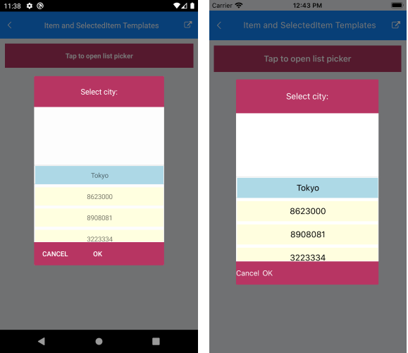

# .NET MAUI ListPicker Templates

The ListPicker for .NET MAUI provides the following templates:

* `ItemTemplate`(`DataTemplate`)&mdash;Defines the template used for displaying the list of items.
* `SelectedItemTemplate`(`DataTemplate`)&mdash;Specifies the template used for visualizing the selected item from the list.
* `PlaceholderTemplate`(`ControlTemplate`)&mdash;Defines the template visualized for the placeholder.  
* `DisplayTemplate`(`ControlTemplate`)&mdash;Defines the template visualized when an item from the list is selected.

Using `SelectorSettings` property (of type `Telerik.XamarinForms.Input.PickerPopupSelectorSettings`) you can define the following templates:

* `HeaderTemplate`(`ControlTemplate`)&mdash;Defines what will be displayed inside the dialog(popup) header.
* `FooterTemplate`(`ControlTemplate`)&mdash;Defines what will be displayed inside the dialog(popup) footer.

This is the Visual Structure of the ListPicker templates:


In addition, the ListPicker for .NET MAUI provides the following properties:

* `ItemsSource`(`IList`)&mdash;Specifies the collection used to generate the content of the list picker.
* `ItemLength`(`double`)&mdash;Defines the length of the items inside the list.
* `ItemSpacing`(`double`)&mdash;Defines the spacing between the items inside the list.
* `SelectedItem`(`object`)&mdash;Specifies the selected item of the list picker
* `DisplayMemberPath`(`string`)&mdash;Defines the path of the property which is to be displayed as `DisplayString`.

## Example

The following example demonstrates how to define a sample ListPicker:

<snippet id='listpicker-features-templates' />

Define the templates in the page resources:

## Item Template

<snippet id='listpicker-features-itemtemplate' />

## SelectedItem Template

<snippet id='listpicker-features-selecteditemtemplate' />

## Placeholder Template

<snippet id='listpicker-features-placeholdertemplate' />

## DisplayTemplate

```XAML
<ControlTemplate x:Key="displayTemplate">
	<StackLayout>
		<Label Text="This is the DisplayTemplate of the ListPicker" FontSize="10"/>
		<Label Text="{TemplateBinding DisplayString}" TextColor="Black" FontSize="15" Grid.Row="1" VerticalTextAlignment="Center"/>
		<StackLayout.GestureRecognizers>
			<TapGestureRecognizer Command="{TemplateBinding ToggleCommand}" />
		</StackLayout.GestureRecognizers>
	</StackLayout>
</ControlTemplate>
```

## Header Template

<snippet id='listpicker-features-headertemplate' />

## Footer Template

<snippet id='listpicker-features-footertemplate' />

Set a sample business model:

<snippet id='listpicker-features-businessmodel' />

Define the `ViewModel`:

<snippet id='listpicker-features-viewmodel' />

Add the following namespace:

```XAML
xmlns:telerik="http://schemas.telerik.com/2022/xaml/maui"
```

The following image shows the end result:



>important For a sample templates example, refer to the **ListPicker/Templates** folder of the [Telerik UI for .NET MAUI SDKBrowser Application]().

## See Also

- [Styling]()
