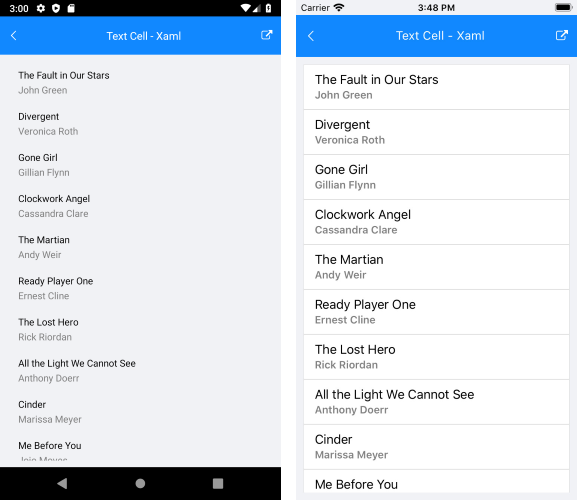

@[template](/_contentTemplates/common/listview-obsolete.md#listview-obsolete)

# .NET MAUI ListView Text Cell

Cells in the ListView are the presentation of each data item from the control's Items Source. You can choose between the `ListViewTextCell` and `ListViewTemplateCell` cell types.

`ListViewTextCell` derives from `Microsoft.Maui.Controls.TextCell` and displays text. It can optionally render detail text as a second row within a list view item. This is the default cell of the ListView.

The example below demonstrates how to create a list view with text cells, like this:



**1.** Create a view model that will be the source of the list view:

<snippet id='listview-celltypes-textcell-viewmodel' />

**2.** Add the definition of the ListView control:

<snippet id='listview-celltypes-textcell-listview-xaml' />

**3.** Add the `telerik` namespaces:

```XAML
xmlns:telerik="http://schemas.telerik.com/2022/xaml/maui"
```

## See Also

- [TemplateCell]()
- [Item Template Selector]()
- [Layouts]()
- [Items Styling]()
