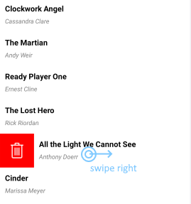

@[template](/_contentTemplates/common/listview-obsolete.md#listview-obsolete)

# .NET MAUI ListView Cell Swipe

Cell swipe allows end-users to use swipe gestures on cells. When users swipe, they reveal a designated custom view with buttons, images etc.

The image below shows how swiping right can reveal a Delete button on the left:

You can reveal another custom view if the user swipes left. In this case, Cell Swipe displays the custom view on the right. As soon as the user taps the swiped item or anywhere on the ListView, the item returns to its original position.

## Properties

You can use the following `RadListView` properties to configure the Cell Swipe feature:

- `IsItemSwipeEnabled`(`bool`)&mdash;Enables or disables the Cell Swipe feature. The default value is False.
- `SwipeThreshold`(`double`)&mdash;Defines the length (in pixels) of the swipe gesture that is required to trigger the feature. Shorter swipe gestures are not respected. The default value is 0.
- `SwipeOffset`(`Thickness`)&mdash;Specifies how to move the swiped cell to the side and stick it there. The default value is 100.
- `ItemSwipeContentTemplate` (`DataTemplate`)&mdash;Defines the content that will be visualized when users swipe a cell.

>tip The `SwipeThreshold` value must be lower than the `SwipeOffset` value. This is required because the `SwipeThreshold` defines the minimum swipe gesture length that triggers the Cell Swipe feature and reveals a custom view.

## Methods

The following `RadListView` methods are related to the cell swiping feature:

- void `EndItemSwipe`(`bool` `isAnimated`)&mdash;Moves the swiped item to its default position.

## Events

The following `RadListView` events are related to the cell swiping feature:

- `ItemSwipeStarting`&mdash;Occurs when the user initiates the swipe gesture. The event arguments are of the `ItemSwipeStartingEventArgs` type that provides the following properties:
  - `Item`(`object`)&mdash;The item that will be swiped.
  - `Cancel`(`bool`)&mdash;If you set this value to `false`, the swiping will be canceled.
- `ItemSwiping`&mdash;Occurs while the user is swiping the item. The event arguments are of the `ItemSwipingEventArgs` type that provides the following properties:
  - `Item`(`object`)&mdash;The item that is being swiped.
  - `Offset`(`double`)&mdash;The current swipe offset.
- `ItemSwipeCompleted`&mdash;Occurs when the user finishes the swipe gesture. The event arguments are of the `ItemSwipeCompletedEventArgs` type that provides the following properties:
  - `Item`(`object`)&mdash;The item that has been swiped.
  - `Offset`(`double`)&mdash;The swipe offset at which the item has been dropped.

## Commands

In addition to the swipe events, `RadListView` provides the following commands related to swipe actions:

- `ItemSwipeStarting`
- `ItemSwiping`
- `ItemSwipeCompleted`

For more details on how to use the ListView commands, see [Commands]().

## See Also

- [ListView Text Cell]()
- [ListView Template Cell]()
- [Layouts]()
- [Commands]()
- [Pull to Refresh]()
- [Reorder Items]()
