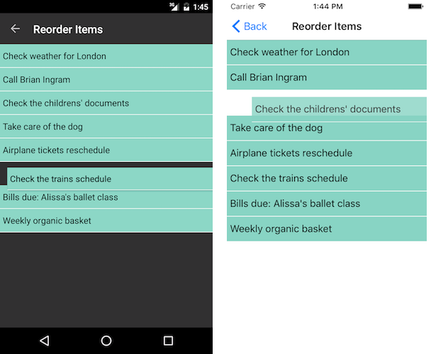

# .NET MAUI ListView Reorder Items

The items reorder feature allows end-users reorder the list view data items. If the feature is enabled, when the user holds on an item, the reorder mode is triggered and the user can move and release the item at the desired position. This will perform reorder operation on the data.

Reorder functionality can be enabled by setting the `IsItemsReorderEnabled` property to `true`.

## Example

This example will demonstrate how to enable the items reorder functionality and style the list view items.

1. Add the ListView definition:

 <snippet id='listview-gestures-reorderitems-listview'/>

1. Define the `telerik` namespace:

 ```XAML
xmlns:telerik="http://schemas.telerik.com/2022/xaml/maui"                 
 ```

1. Add a simple Items Source to the ListView:

 <snippet id='listview-gestures-reorderitems-code'/>

Here is the result:



>You can also take advantage of the [Reorder Events](#groupreorder-events) for additional control over the reorder functionality of the ListView.

## See Also

- [ListView Text Cell]()
- [ListView Template Cell]()
- [Layouts]()
- [Cell Swipe]()
- [Pull to Refresh]()
