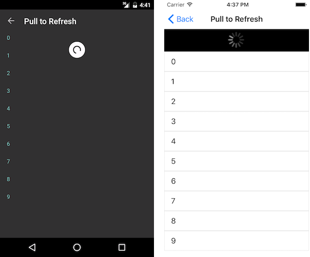

@[template](/_contentTemplates/common/listview-obsolete.md#listview-obsolete)

# .NET MAUI ListView Pull to Refresh

If the list contains items which may change after the initial load, it may be good idea to allow users to refresh that list. Telerik ListView for .NET MAUI is capable of doing this by a pull-to-refresh gesture. The feature allows the data to be refreshed by swiping finger down when the content is scrolled up to the top. This will trigger an animated activity indicator which will stay visible until data is refreshed.

This feature consists of:

- `IsPullToRefreshEnabled`&mdash;A boolean property which enables/disables the pull-to-refresh feature. The default value of the property is `false`.
- `RefreshRequested`&mdash;A public event which is raised when the pull-to-refresh gesture is triggered. The custom data refreshing logic have to be implemented in its handler.
- `EndRefresh()`&mdash;A public method which must be called when the custom data refreshing logic finishes executing.


## Example

This example demonstrates how to enable the pull to refresh functionality.

**1.** Add the ListView definition:

<snippet id='listview-gestures-pulltorefresh-listview'/>

**2.** Define the `telerik` namespace:

```XAML
xmlns:telerik="http://schemas.telerik.com/2022/xaml/maui"                 
```

**3.** Set sample Items Source to the ListView:

<snippet id='listview-gestures-pulltorefresh-source'/>

**4.** Add the `RefreshRequested` method that updates the source of the ListView when refresh is triggered:

<snippet id='listview-gestures-pulltorefresh-event'/>

This is how the refresh indicator looks like:



## Troubleshooting

ListView should not be used in a View that restricts the Height to the minimum amount of vertical space. An example is `StackLayout` or a Grid with `<RowDefinition Height="Auto" />`. This will restrict the ListView from expanding when items are populated and  prevents Pull To Refresh from working correctly.

The recommended use is to place the `RadListView` control in a container that expands to fill available space. For example, the `RadListView` in the example below is in the star-sized Grid `RowDefinition`.

```
<Grid>
    <Grid.RowDefinitions>
        <RowDefinition Height="*" />
        <RowDefinition Height="Auto" />
    </Grid.RowDefinitions>

    <!-- This RadListView is in the star-sized row and will expand properly -->
    <telerikDataControls:RadListView x:Name="EventsList" />

    <Label Text="I'm in auto-sized row" Grid.Row="1" />
</Grid>
```

## See Also

- [ListView Text Cell]()
- [ListView Template Cell]()
- [Layouts]()
- [Cell Swipe]()
- [Reorder Items]()
