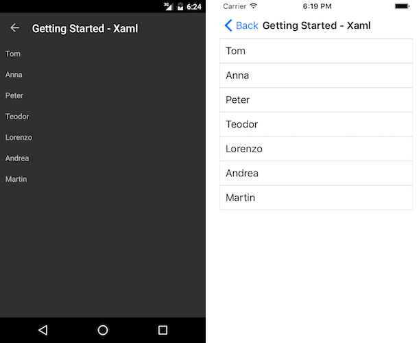

# Getting Started

This guide provides the information you need to start using the Telerik UI for .NET MAUI ListView by adding the control to your project.

At the end, you will be able to achieve the following result.



## Prerequisites

Before adding the ListView, you need to:

1. [Set up your .NET MAUI application](#set-up-your-net-maui-application).

1. [Download Telerik UI for .NET MAUI](#download-telerik-ui-for-net-maui).

1. [Install Telerik UI for .NET MAUI](#install-telerik-ui-for-net-maui).

## Define the Control

When your .NET MAUI application is set up, you are ready to add a ListView control to your page. The following example shows a sample ListView definition populated with sample data.

  The ListView provides UI virtualization, which requires the visual parent to provide vertical or horizontal space. To avoid breaking UI virtualization or gesture mechanisms:

  * Do not place the ListView inside a `StackLayout` or inside a `ScrollView`.
  * Do not set the ListVew to a `RowDefinition Height="Auto"` Grid definition.

Set up the `RadListView` instance:

```XAML
<telerik:RadListView x:Name="listView" ItemsSource="{Binding Source}">
    <telerik:RadListView.BindingContext>
        <local:ViewModel />
    </telerik:RadListView.BindingContext>
    <telerik:RadListView.ItemTemplate>
        <DataTemplate>
            <telerik:ListViewTemplateCell>
                <telerik:ListViewTemplateCell.View>
                    <Grid>
                        <Label Margin="10" Text="{Binding Name}" />
                    </Grid>
                </telerik:ListViewTemplateCell.View>
            </telerik:ListViewTemplateCell>
        </DataTemplate>
    </telerik:RadListView.ItemTemplate>
</telerik:RadListView>
```

Add the `telerik` namespaces:

```XAML
xmlns:telerik="http://schemas.telerik.com/2022/xaml/maui"
```

Let's create sample `Data` and `ViewModel` classes:

<snippet id='listview-gettingstarted-source' />

Register the Telerik controls through the `Telerik.Maui.Controls.Compatibility.UseTelerik` extension method called inside the `CreateMauiApp` method of the `MauiProgram.cs` file of your project:

```C#
using Telerik.Maui.Controls.Compatibility;

public static class MauiProgram
{
	public static MauiApp CreateMauiApp()
	{
		var builder = MauiApp.CreateBuilder();
		builder
			.UseTelerik()
			.UseMauiApp<App>()
			.ConfigureFonts(fonts =>
			{
				fonts.AddFont("OpenSans-Regular.ttf", "OpenSansRegular");
			});

		return builder.Build();
	}
}           
```

## Additional Resources

- [.NET MAUI ListView product page](https://www.telerik.com/maui-ui/listview)
- [.NET MAUI ListView forum page](https://www.telerik.com/forums/maui?tagId=1829)
- [Telerik .NET MAUI blogs](https://www.telerik.com/blogs/mobile-net-maui)
- [Telerik .NET MAUI roadmap](https://www.telerik.com/support/whats-new/maui-ui/roadmap)

## See Also

- [ListView TextCell]()
- [ListView TemplateCell]()
- [Selection]()
- [Grouping]()
