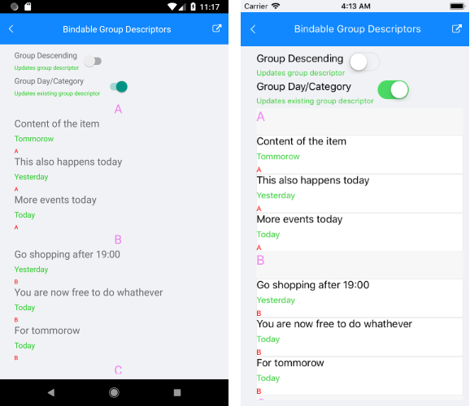

# Bindable GroupDescriptor

The GroupDescriptor collection now can be controlled by users using MVVM.

In order to control the GroupDescriptor collection through MVVM:

1. Create a property of type `ObservableCollection<GroupDescriptorBase>` in your `ViewModel` which will contain the needed group descriptors:

 ```C#
 public class ViewModel : NotifyPropertyChangedBase
{
    private ObservableCollection<GroupDescriptorBase> groupDescriptors;
    private bool isPropertyNameGroupSwitchToggled;
    private bool isSortOrderGroupSwitchToggled;
    private List<Event> items;

    public ViewModel()
    {
        this.Items = this.GetItems();
        this.groupDescriptors = new ObservableCollection<GroupDescriptorBase>();
    }
    // >> listview-features-bindable-groupdescriptor-viewmodel
    public ObservableCollection<GroupDescriptorBase> GroupDescriptors
    {
        get { return this.groupDescriptors; }
        set { this.UpdateValue(ref this.groupDescriptors, value); }

    }
    // << listview-features-bindable-groupdescriptor-viewmodel
    public bool IsPropertyNameGroupSwitchToggled
    {
        get { return this.isPropertyNameGroupSwitchToggled; }
        set { this.UpdateValue(ref this.isPropertyNameGroupSwitchToggled, value); }

    }

    public bool IsSortOrderGroupSwitchToggled
    {
        get { return this.isSortOrderGroupSwitchToggled; }
        set { this.UpdateValue(ref this.isSortOrderGroupSwitchToggled, value); }

    }

    public List<Event> Items
    {
        get { return this.items; }
        set { this.UpdateValue(ref this.items, value); }

    }

    private List<Event> GetItems()
    {
        var results = new List<Event>();

        results.Add(new Event() { Content = "Content of the item", Day = "Tommorow", Category = "A" });
        results.Add(new Event() { Content = "This also happens today", Day = "Yesterday", Category = "A" });
        results.Add(new Event() { Content = "More events today", Day = "Today", Category = "A" });
        results.Add(new Event() { Content = "Go shopping after 19:00", Day = "Yesterday", Category = "B" });
        results.Add(new Event() { Content = "You are now free to do whathever", Day = "Today", Category = "B" });

        results.Add(new Event() { Content = "For tommorow", Day = "Today", Category = "B" });
        results.Add(new Event() { Content = "It is a free day", Day = "Yesterday", Category = "C" });
        results.Add(new Event() { Content = "Go have some fun", Day = "Tommorow", Category = "C" });
        results.Add(new Event() { Content = "Party", Day = "Tommorow", Category = "C" });

        return results;
    }

    private void UpdateExistingGroupDescriptor(string propertyToUpdate)
    {
        if (this.GroupDescriptors == null)
            return;

        if (this.GroupDescriptors.Count == 0)
        {
            this.GroupDescriptors.Add(new PropertyGroupDescriptor()
            {
                PropertyName = "Day",
                SortOrder = SortOrder.Ascending
            });
        }

        if (propertyToUpdate.Equals(nameof(IsSortOrderGroupSwitchToggled)))
        {
            var descriptor = (PropertyGroupDescriptor)this.GroupDescriptors.FirstOrDefault();
            descriptor.SortOrder = isSortOrderGroupSwitchToggled ? SortOrder.Descending : SortOrder.Ascending;
        }
        else if (propertyToUpdate.Equals(nameof(IsPropertyNameGroupSwitchToggled)))
        {
            var descriptor = (PropertyGroupDescriptor)this.GroupDescriptors.FirstOrDefault();
            descriptor.PropertyName = isPropertyNameGroupSwitchToggled ? "Category" : "Day";
        }
    }
}
 ```

1. Use the `OneWayToSource` binding mode to bind that property to the `GroupDescriptors` property of `RadListView`:

 ```XAML
<Grid Margin="16,0,0,0">
    <Grid.RowDefinitions>
        <RowDefinition Height="40" />
        <RowDefinition Height="40" />
        <RowDefinition />
    </Grid.RowDefinitions>

    <HorizontalStackLayout>
        <VerticalStackLayout>
            <Label Text="Group Descending" />
            <Label Text="Updates group descriptor" FontSize="Micro" TextColor="LimeGreen" />
        </VerticalStackLayout>
        <Switch IsToggled="{Binding IsSortOrderGroupSwitchToggled, Mode=TwoWay}" AutomationId="GroupSortingSwitch"/>
    </HorizontalStackLayout>
    <HorizontalStackLayout Grid.Row="1">
        <VerticalStackLayout>
            <Label Text="Group Day/Category" />
            <Label Text="Updates existing group descriptor" FontSize="Micro" TextColor="LimeGreen" />
        </VerticalStackLayout>
        <Switch IsToggled="{Binding IsPropertyNameGroupSwitchToggled, Mode=OneWayToSource}" AutomationId="GroupOrderSwitch"/>
    </HorizontalStackLayout>
    <!-- >> listview-features-bindable-groupdescriptor-xaml -->
    <telerikDataControls:RadListView x:Name="listView"
                                Grid.Row="2"
                                GroupDescriptors="{Binding GroupDescriptors, Mode=OneWayToSource}"  
                                ItemsSource="{Binding Items}">
        <!-- << listview-features-bindable-groupdescriptor-xaml -->
        <telerikDataControls:RadListView.GroupHeaderTemplate>
            <DataTemplate>
                <Label Text="{Binding }" TextColor="Violet" FontSize="Large" HorizontalOptions="CenterAndExpand" />
            </DataTemplate>
        </telerikDataControls:RadListView.GroupHeaderTemplate>
        <telerikDataControls:RadListView.ItemTemplate>
            <DataTemplate>
                <telerikListView:ListViewTemplateCell>
                    <telerikListView:ListViewTemplateCell.View>
                        <StackLayout>
                            <Label Text="{Binding Content}" FontSize="Medium" />
                            <Label Text="{Binding Day}" FontSize="Small" TextColor="LimeGreen" />
                            <Label Text="{Binding Category}" FontSize="Micro" TextColor="Red" />
                        </StackLayout>
                    </telerikListView:ListViewTemplateCell.View>
                </telerikListView:ListViewTemplateCell>
            </DataTemplate>
        </telerikDataControls:RadListView.ItemTemplate>
    </telerikDataControls:RadListView>
 </Grid>
 ```

Here is how the `GroupDescriptor` collection looks like through MVVM:



>important For a **Bindable Group Descriptors** demo, refer to the **ListView/Bindable Collections** folder of the [SDKBrowser MAUI application]().

## See Also

- [Filtering]()
- [Sorting]()
- [Selection]()
