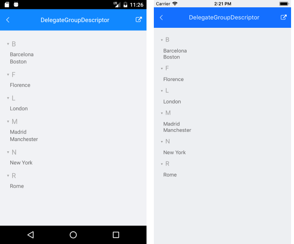

# Grouping

The ListView provides the functionality to programmatically group its data at runtime. This can be achieved through adding `GroupDescriptors` to the `RadListView.GroupDescriptors` collection.

* `PropertyGroupDescriptor`
* `DelegateGroupDescriptor`

## DelegateGroupDescriptor

This descriptor enables you to group by a custom key (e.g. some complex expression combining two or more properties) instead of being limited by the value of a single property. This descriptor exposes the following properties:

- `KeyExtractor`&mdash;Defines the `(Func<object, object)` delegate which returns the property to retrieve the group key for each data item.
- `SortOrder`&mdash;Defines the sort order in each group to Ascending or Descending.

Let's use the same example from the previous section, just add DelegateGroupDescriptor through code instead.

Define the `RadListView`:

<snippet id='listview-grouping-delegategroupdescriptor' />

Include the `telerik` namespace:

```XAML
xmlns:telerik="http://schemas.telerik.com/2022/xaml/maui" 
```

Create and apply a delegate for grouping the items (for example by their first letter) as following:

<snippet id='listview-grouping-delegategroupdescriptor-settingdelegate' />

Add a business model:

<snippet id='listview-grouping-groupdescriptors-businessobject' />

Add a `ViewModel` with a collection of Cities:

<snippet id='listview-grouping-groupdescriptors-viewmodel' />

The following image shows a ListView grouped through the `DelegateGroupDescriptor`.



> For the ListView DelegateGroupDescriptor example, go to the [SDKBrowser Demo Application]() and navigate to ListView  -> Grouping category.

## See Also

- [Filtering]()
- [Sorting]()
- [Selection]()
