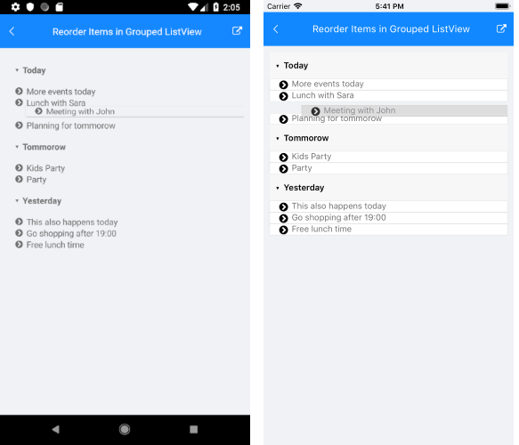

# Reorder Items in Grouped ListView

This help topic will provide an overview on how you could enable reordering feature of the ListView control when its items are grouped.

>tip Before proceeding, check the [Reorder Items]() topic which describes in details the reordering functionality of the ListView.

When the items of the ListView are grouped by certain criteria and the end user drags/starts reordering an item, the dragged item can be added to a different group. Since this depends on the items' relation, to handle the scenario, you need to subscribe to the ListView `Reorder` command and manually update the dragged item details.

The `ReorderEndedCommandContext` gives you access to the following properties:

* `Item`&mdash;Refers to the data item that is being interacted with.
* `DestinationItem`&mdash;Refers to the data item that corresponds to the location where the dragged item has been released.
* `Group`&mdash;Gets the group containing the data item that is being interacted with.
* `DestinationGroup`&mdash;Refers to the group that corresponds to the location where the dragged item has been released.
* `Placement` (of type `ItemReorderPlacement`)&mdash;Indicates whether the dragged item should be placed before or after the destination item.

Below you can find a sample implementation.

1. The `RadListView` definition with the `PropertyGroupDescriptor` and `Reorder` command applied:

 ```XAML
 <telerikDataControls:RadListView x:Name="listView"
                                     ItemsSource="{Binding Events}"
                                     IsItemsReorderEnabled="True">
    <telerikDataControls:RadListView.BindingContext>
        <local:ViewModel/>
    </telerikDataControls:RadListView.BindingContext>
    <telerikDataControls:RadListView.ItemTemplate>
        <DataTemplate>
            <telerikListView:ListViewTemplateCell>
                <telerikListView:ListViewTemplateCell.View>
                    <Label Text="{Binding Content}" TextColor="#6F6F70" FontSize="Small" />
                </telerikListView:ListViewTemplateCell.View>
            </telerikListView:ListViewTemplateCell>
        </DataTemplate>
    </telerikDataControls:RadListView.ItemTemplate>
    <telerikDataControls:RadListView.GroupDescriptors>
        <telerikListView:PropertyGroupDescriptor PropertyName="Day"/>
    </telerikDataControls:RadListView.GroupDescriptors>
    <telerikDataControls:RadListView.Commands>
        <telerikListViewCommands:ListViewUserCommand Id="ReorderEnded"
                                                     Command="{Binding ReorderCommand}" />
    </telerikDataControls:RadListView.Commands>
</telerikDataControls:RadListView>
 ```

1. Add the namespaces used:

 ```XAML
xmlns:telerikDataControls="clr-namespace:Telerik.XamarinForms.DataControls;assembly=Telerik.Maui.Controls.Compatibility"
xmlns:telerikListView="clr-namespace:Telerik.XamarinForms.DataControls.ListView;assembly=Telerik.Maui.Controls.Compatibility"
xmlns:telerikListViewCommands="clr-namespace:Telerik.XamarinForms.DataControls.ListView.Commands;assembly=Telerik.Maui.Controls.Compatibility"
 ```

1. Create a `ViewModel` class containing a collection of `Event` objects as well as a `Reorder` command implementation considering the `Events` will be grouped according to the `Day` property. Inside the `Reorder` command you will have access to some useful details through the `ReorderEndedCommandContext` such as:

 ```C#
public class ViewModel
{
    public ViewModel()
    {
        this.Events = new ObservableCollection<Event>()
        {
            new Event() { Content = "Meeting with John", Day = "Tommorow" },
            new Event() { Content = "This also happens today", Day = "Yesterday" },
            new Event() { Content = "More events today", Day = "Today" },
            new Event() { Content = "Go shopping after 19:00", Day = "Yesterday" },
            new Event() { Content = "Lunch with Sara", Day = "Today" },
            new Event() { Content = "Planning for tommorow", Day = "Today"},
            new Event() { Content = "Free lunch time", Day = "Yesterday" },
            new Event() { Content = "Kids Party", Day = "Tommorow" },
            new Event() { Content = "Party", Day = "Tommorow" }
        };
        this.ReorderCommand = new Command<ReorderEndedCommandContext>(this.Reorder);
    }
    public ObservableCollection<Event> Events { get; set; }
    public Command<ReorderEndedCommandContext> ReorderCommand { get; }
    private void Reorder(ReorderEndedCommandContext context)
    {
        var sourceItem = (Event)context.Item;

        this.Events.Remove(sourceItem);

        var destinationItem = (Event)context.DestinationItem;
        var destinationGroup = context.DestinationGroup;
        var destinationIndex = this.Events.IndexOf(destinationItem);

        if (context.Placement == ItemReorderPlacement.After)
        {
            destinationIndex++;
        }

        sourceItem.Day = (string)destinationGroup.Key;
        this.Events.Insert(destinationIndex, sourceItem);
    }
}
 ```

1. And the business model:

 ```C#
public class Event : NotifyPropertyChangedBase
{
    public string content;
    public string day;
    public string category;

    public string Content
    {
        get { return this.content; }
        set { this.UpdateValue(ref this.content, value); }

    }
    public string Day
    {
        get { return this.day; }
        set { this.UpdateValue(ref this.day, value); }

    }
    public string Category
    {
        get { return this.category; }
        set { this.UpdateValue(ref this.category, value); }

    }
}
 ```


The following image shows the result:



## See Also

- [Grouping]()
- [Commands]()
