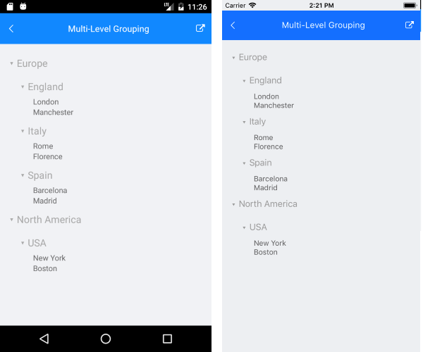

# .NET MAUI ListView Multi-Level Grouping

This article provides an overview on how you can enable multi-level grouping in the ListView.

>note Before proceeding, go through the [Grouping Overview]() topic.

Create the following business object:

<snippet id='listview-grouping-groupdescriptors-businessobject' />

Create a `ViewModel` class as shown below:

<snippet id='listview-grouping-groupdescriptors-viewmodel' />

To visualize the hierarchical relation between groups, add a custom `GroupHeaderTemplate` (of type `DataTemplate`) to the Resources of your page:

<snippet id='listview-grouping-multilevel-templates' />

The `LevelToMarginConverter` calculates the margin of each group header according to its Level:

<snippet id='listview-grouping-multilevel-converter' />

Add the `RadListView` definition with two `PropertyGroupDescriptors` as shown in the next snippet:

<snippet id='listview-grouping-multilevel-definition' />

Include the `telerik` namespace:

```XAML
xmlns:telerik="http://schemas.telerik.com/2022/xaml/maui" 
```

The following image shows the final result.



## See Also

- [Grouping]()
- [Filtering]()
- [Sorting]()
