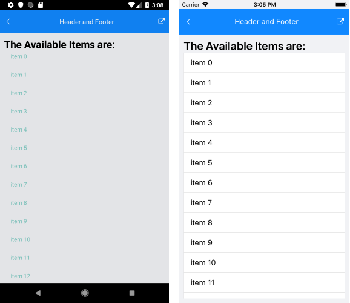
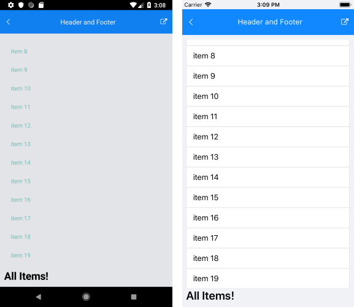

# .NET MAUI ListView Header and Footer

The ListView provides the option to add - `Header` and `Footer`, which will allow you to position content of your choice above and below the list with the items. Both header and footer templates are scrolled along with the ListView items.

* `HeaderTemplate`(`DataTemplate`)&mdash;Defines the Header of the ListView before all items.
* `FooterTemplate`(`DataTemplate`)&mdash;Defines the Footer of the ListView after all items.

The following example shows how to add a Header and a Footer to the ListView control.

1. Create a `ViewModel`:

 <snippet id='listview-features-header-and-footer-viewmodel'/>

1. Add the following sample `DataTemplates` to the resources of the page that will be used as:

* Example how to define the Header Template

 <snippet id='listview-features-header-template-xaml'/>

 * Example how to define the Footer Template

 <snippet id='listview-features-footer-template-xaml'/>

1. Use the following snippet to declare the ListView in XAML:

 <snippet id='listview-features-header-and-footer-xaml'/>

The following image shows how the ListView Header looks.

The following image shows how the ListView Footer looks.

>important For a sample Header and Footer example, refer to the **SDKBrowser MAUI application**.

## See Also

- [Events]()
- [Selection]()
- [Reordering]()
