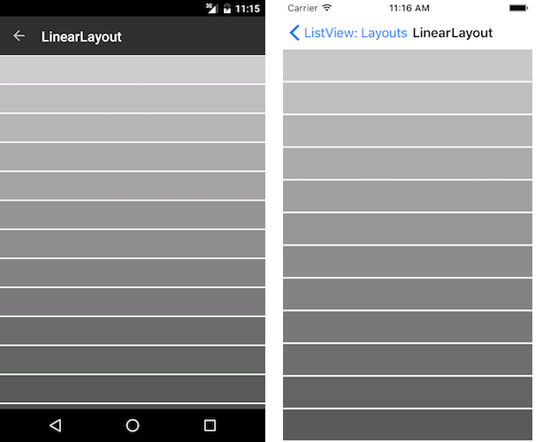
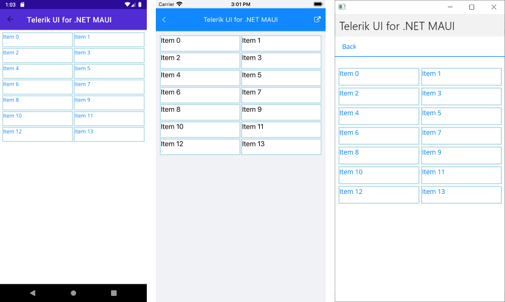

# Layouts

The ListView control supports two layouts: linear and grid through its `LayoutDefinition` property. It accepts values of type `ListViewLayoutBase` which is a base class for all list view layouts.

Here are the properties exposed by the `ListViewLayoutBase` class:

- `VerticalItemSpacing` (`double`)&mdash;Gets or sets the vertical space between two items.
- `HorizontalItemSpacing` (`double`)&mdash;Gets or sets the horizontal space between two items.
- `ItemLength` (`double`)&mdash;Gets or sets the width or height (depending on the layout orientation) of the items. The default value is `-1`, which means that the items will be sized according to the targeted platform default behavior.
- `GroupHeaderLength` (`double`)&mdash;Gets or sets the width or height (depending on the layout orientation) of the group headers. The default value is -1 which means that the items will be sized according to the targeted platform default behavior.
- `Orientation` (`Orientation`)&mdash;Gets or sets the orientation (scroll direction) of the layout.

## Linear Layout

Linear layout is the default layout of the control. It can be explicitly set by creating an instance of the `ListViewLinearLayout` class and assigning it to the `RadListView.LayoutDefinition` property.

The following example demonstrates how to use the `RadListViewLinearLayout`.

1. Define the list view in XAML:

 <snippet id='listview-layouts-linearlayout-listview'/>
 
	In the example:

 ```XAML
xmlns:telerik="http://schemas.telerik.com/2022/xaml/maui"
 ```

1. Add the `ViewModel` class with the `ItemsSource` collection:

 <snippet id='listview-layouts-linearlayout-source'/>
 
The following image shows the result:



## Grid Layout

The Grid Layout allows distributing cells in a fixed number of columns/rows. To the basic layout properties, it exposes the `SpanCount` (`int`) property, which gets or sets the count of the columns/rows (depending on the orientation) of the list.

The grid layout can be utilized by setting the `RadListView.LayoutDefinition` property to a new instance of the `ListViewGridLayout` class.

The following example demonstrates how to use the `RadListViewGridLayout`.

1. Define the list view in XAML:

 <snippet id='listview-layouts-gridlayout-listview'/>

1. Add the `ViewModel` class with the `ItemsSource` collection:

 <snippet id='listview-layouts-linearlayout-source'/>
 
The following image shows the result:



## See Also

- [ListView TextCell]()
- [ListView TemplateCell]()
- [Cell Swipe]()
- [Pull to Refresh]()
- [Reorder Items]()
