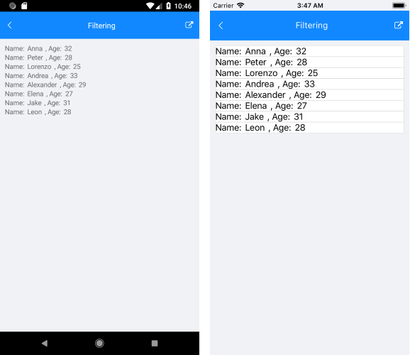
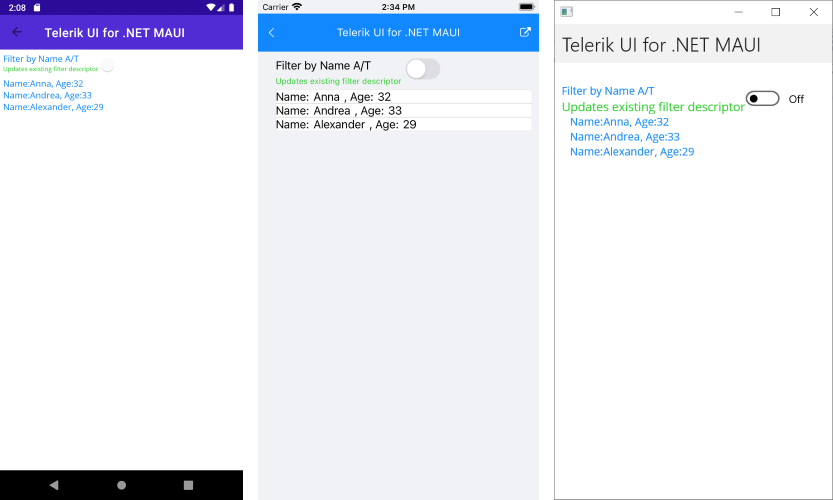

# Filtering

The ListView provides the functionality to programmatically filter its data at runtime. This can be achieved through adding filter descriptors that implement the IFilter interface to the `RadListView.FilterDescriptors` collection. You can use our `DelegateFilterDescriptor` implementation.

## DelegateFilterDescriptor

The `DelegateFilterDescriptor` property supports a `Filter`, which defines the function used to check whether a data item passes the filter or not.

1. First, define the ListView in XAML:

 <snippet id='listview-features-filtering-xaml'/>
 ```XAML
<telerikDataControls:RadListView x:Name="listView"
								 ItemsSource="{Binding Items}">
	<telerikDataControls:RadListView.BindingContext>
		<local:ViewModel/>
	</telerikDataControls:RadListView.BindingContext>
	<telerikDataControls:RadListView.ItemTemplate>
		<DataTemplate>
			<telerikListView:ListViewTemplateCell>
				<telerikListView:ListViewTemplateCell.View>
					<HorizontalStackLayout>
						<Label Text="Name:"/>
						<Label Text="{Binding Name}"/>
						<Label Text=", Age:"/>
						<Label Text="{Binding Age}"/>
					</HorizontalStackLayout>
				</telerikListView:ListViewTemplateCell.View>
			</telerikListView:ListViewTemplateCell>
		</DataTemplate>
	</telerikDataControls:RadListView.ItemTemplate>
</telerikDataControls:RadListView>
 ```

1. Add a `DelegateFilterDescriptor` to the `FilerDescriptors` collection of the ListView instance:

 <snippet id='listview-features-filtering-agefilter'/>
 ```C#
listView.FilterDescriptors.Add(new Telerik.XamarinForms.DataControls.ListView.DelegateFilterDescriptor { Filter = this.AgeFilter });
 ```

1. Here is the `AgeFilter` method containing the filtering logic:

 ```C#
private bool AgeFilter(object arg)
{
    var age = ((Item)arg).Age;
    return age >= 25 && age <= 35;
}
 ```

1. Define the `ViewModel` class:

 <snippet id='listview-features-filtering-viewmodel'/>
 ```C#
public class ViewModel
{
	public ViewModel()
	{
		this.Items = GetData();
	}

	public ObservableCollection<Person> Items { get; set; }

	private static ObservableCollection<Person> GetData()
	{
		var items = new ObservableCollection<Person>();

		items.Add(new Person { Name = "Tom", Age = 41 });
		items.Add(new Person { Name = "Anna", Age = 32 });
		items.Add(new Person { Name = "Peter", Age = 28 });
		items.Add(new Person { Name = "Teodor", Age = 39 });
		items.Add(new Person { Name = "Lorenzo", Age = 25 });
		items.Add(new Person { Name = "Andrea", Age = 33 });
		items.Add(new Person { Name = "Martin", Age = 36 });
		items.Add(new Person { Name = "Alexander", Age = 29 });
		items.Add(new Person { Name = "Maria", Age = 22 });
		items.Add(new Person { Name = "Elena", Age = 27 });
		items.Add(new Person { Name = "Stefano", Age = 44 });
		items.Add(new Person { Name = "Jake", Age = 31 });
		items.Add(new Person { Name = "Leon", Age = 28 });

		return items;
	}
}
 ```

1. Set the `Person` data class:

 <snippet id='listview-features-filtering-data-class'/>
 ```C#
public class Person
{
	public string Name { get; set; }
	public int Age { get; set; }
}
 ```


The following image shows the result after the data is filtered:



## Bindable FilterDescriptors

The `FilerDescriptors` collection of the ListView supports binding, which means that you can modify the directly descriptors directly from the `ViewModel`.

To control the `FilterDescriptor` collection through MVVM:

1. Create a property of type `ObservableCollection<FilterDescriptorBase>` in your `ViewModel`, which will contain the needed filters.

 <snippet id='listview-features-bindable-filterdescriptor-viewmodel' />
 ```C#
public ObservableCollection<FilterDescriptorBase> FilterDescriptors
{
	get { return this.filterDescriptors; }
	set { this.UpdateValue(ref this.filterDescriptors, value); }
}
 ```

1. Use the `OneWayToSource` binding mode to bind that property to the `FilterDescriptors` property of ListView. For demonstration purposes this ListView uses the same `ViewModel` as in the previous example:

 <snippet id='listview-features-bindable-filterdescriptor-xaml' />
 ```XAML
<telerikDataControls:RadListView x:Name="listView"
								 Grid.Row="1"
								 ItemsSource="{Binding Items}"
								 FilterDescriptors="{Binding FilterDescriptors, Mode=OneWayToSource}" >
	<telerikDataControls:RadListView.ItemTemplate>
		<DataTemplate>
			<telerikListView:ListViewTemplateCell>
				<telerikListView:ListViewTemplateCell.View>
					<HorizontalStackLayout>
						<Label Text="Name:"/>
						<Label Text="{Binding Name}"/>
						<Label Text=", Age:"/>
						<Label Text="{Binding Age}"/>
					</HorizontalStackLayout>
				</telerikListView:ListViewTemplateCell.View>
			</telerikListView:ListViewTemplateCell>
		</DataTemplate>
	</telerikDataControls:RadListView.ItemTemplate>
</telerikDataControls:RadListView>
 ```

1. According to your preferences, add sort descriptors to the `FilerDescriptors` collection in the `ViewModel`:

 ```C#
private void UpdateExistingFilterDescriptor()
{
	if (this.FilterDescriptors == null)
		return;

	if (this.FilterDescriptors.Count == 0)
	{
		this.FilterDescriptors.Add(new DelegateFilterDescriptor()
		{
			Filter = new Func<object, bool>((item) => ((Person)item).Name.Equals("A"))
		});
	}
}
 ```


The following image shows how this looks like:



## See Also

- [Grouping]()
- [Sorting]()
- [Selection]()
