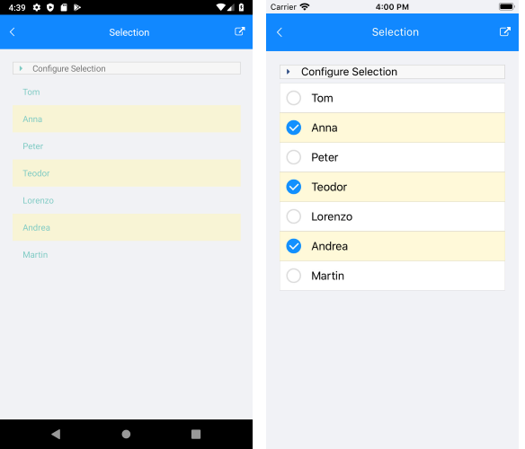

# Selection

The ListView component exposes selection feature. It allows single or multiple selection of the ListView items. This feature provides both visual and programmatic feedback for the actions of the user. Also you can disable the selection.

## Selection Mode

The ListView provides three selection modes, which allow you to manipulate the type of selection. This is controlled by the `SelectionMode` (`Telerik.XamarinForms.DataControls.ListView.SelectionMode`) property which has the following entries:

- `None`&mdash;This mode doesn't allow users to select an item.
- `Single`&mdash;This is the default selection mode. It allows users to select only one item.
- `Multiple`&mdash;This mode allows users to select more than one item.

Check below how you can set `SelectionMode` in XAML and code-behind:

```XAML
<telerikDataControls:RadListView x:Name="listView"
                                 SelectionMode="Multiple" />
```
```C#
var listView = new RadListView();
listView.SelectionMode = Telerik.XamarinForms.DataControls.ListView.SelectionMode.Multiple;
```

## Selection Gestures

You can also configure how the selection to be triggered by the end users through the `SelectionGesture` (`Telerik.XamarinForms.DataControls.ListView.SelectionGesture`) property:

- `Tap`&mdash;Tap on an item to select it. This is the default `SelectionGesture` value.
- `Hold`&mdash;Ttap and hold an item to select it.

```XAML
<telerikDataControls:RadListView x:Name="listView"
                                 SelectionGesture="Hold" />
```
```C#
var listView = new RadListView();
listView.SelectionGesture = Telerik.XamarinForms.DataControls.ListView.SelectionGesture.Hold;
```

## Selected Item

The ListView provides the `SelectedItem` (`object`) property, which specifies the last selected item of the ListView.

## Selected Items Collection

The ListView provides the `SelectedItems` (`ObservableCollection&lt;object&gt;`) property, which is a read-only collection used to get the currently selected items.

## Selection Events

The ListView provides the `SelectionChanged` event, which is triggered whenever the `SelectedItems` collection is changed. The `SelectionChanged` event handler receives two parameters:

* The sender argument which is of type object, but can be cast to the `RadListView` type.
* A `NotifyCollectionChangedEventArgs` object which provides information on the collection changed event. For more details, refer to the [NotifyCollectionChangedEventArgs Class](https://docs.microsoft.com/en-us/dotnet/api/system.collections.specialized.notifycollectionchangedeventargs) topic.

## Styling the Selected Item(s)

You can customize the way selected items look by applying `SelectedItemStyle` property to the `RadListView` instance. For detailed information on the approach, go to the [Items Styles]() topic in ListView documentation.

## Example

The example below shows how to utilize ListView selection feature and demonstrates how to set multiple selection, apply a selected item style, and retrieve the selected items in a `ViewModel` class.

1. First, create a `ViewModel` class with two collections&mdash;one for the `ItemsSource` of the ListView and one that will hold the `SelectedItems`. For the purpose of the example, the ListView is bound to a collection of strings:

 ```C#
public class ViewModel : NotifyPropertyChangedBase
{
    private ObservableCollection<object> _selectedNames;
    public ViewModel()
    {
        this.Names = new ObservableCollection<string>() { "Tom", "Anna", "Peter", "Teodor", "Lorenzo", "Andrea", "Martin" };
    }
    public ObservableCollection<string> Names { get; set; }
    public ObservableCollection<object> SelectedNames
    {
        get { return this._selectedNames; }
        set
        {
            if (this._selectedNames != value)
            {
                if (this._selectedNames != null)
                {
                    this._selectedNames.CollectionChanged -= this.SelectedNamesCollectionChanged;
                }

                this._selectedNames = value;

                if (this._selectedNames != null)
                {
                    this._selectedNames.CollectionChanged += this.SelectedNamesCollectionChanged;
                }

                OnPropertyChanged("SelectedNames");

            }
        }
    }
    private void SelectedNamesCollectionChanged(object sender, NotifyCollectionChangedEventArgs e)
    {
        if (this.SelectedNames.Count > 0)
        {
            Application.Current.MainPage.DisplayAlert("Selected items:", string.Join(",", this.SelectedNames.ToArray()), "OK");
        }
    }
}
 ```

1. Next, add a `RadListView` instance to your page with selection properties applied:

 ```XAML
<Grid Margin="10">
    <Grid.RowDefinitions>
        <RowDefinition Height="Auto"/>
        <RowDefinition/>
    </Grid.RowDefinitions>
            <VerticalStackLayout Margin="10">
                <Label Text="Set selection mode:" />
                <Picker x:Name="selectionModePicker" AutomationId="SelectionModePicker"/>
                <Label Text="Set selection gesture:" />
                <Picker x:Name="selectionGesturePicker" AutomationId="SelectionGesturePicker"/>
            </VerticalStackLayout>
    <Grid Grid.Row="1">
        <!-- >> listview-features-selection-xaml -->
        <telerikDataControls:RadListView  x:Name="listView" Margin="10"
                                      ItemsSource="{Binding Names}"
                                      SelectionMode="Multiple"
                                      SelectedItems="{Binding SelectedNames}">
            <telerikDataControls:RadListView.SelectedItemStyle>
                <telerikListView:ListViewItemStyle BackgroundColor="#88FFF5BA"
                                               BorderColor="#88FFF5BA" />
            </telerikDataControls:RadListView.SelectedItemStyle>
        </telerikDataControls:RadListView>
        <!-- << listview-features-selection-xaml -->
    </Grid>
</Grid>
 ```

1. Add the namespaces:

 ```XAML
xmlns:telerikDataControls="clr-namespace:Telerik.XamarinForms.DataControls;assembly=Telerik.Maui.Controls.Compatibility"
xmlns:telerikListView="clr-namespace:Telerik.XamarinForms.DataControls.ListView;assembly=Telerik.Maui.Controls.Compatibility"                       
 ```

1. Set the `ViewModel` class as a `BindingContext` and call the `InitializePickers()` method:

 ```C#
this.BindingContext = new ViewModel();
this.InitializePickers();
 ```

1. Implement the `InitializePickers` and `SelectionChanged` events:

 ```C#
private void InitializePickers()
{
    selectionModePicker.Items.Add("None");
    selectionModePicker.Items.Add("Single");
    selectionModePicker.Items.Add("Multiple");
    selectionModePicker.SelectedIndexChanged += this.OnSelectionModeChanged;
    selectionModePicker.SelectedIndex = 2;
    selectionGesturePicker.Items.Add("Tap");
    selectionGesturePicker.Items.Add("Hold");
    selectionGesturePicker.SelectedIndexChanged += this.OnSelectionGestureChanged;
    selectionGesturePicker.SelectedIndex = 0;
}

// >> listview-features-onselectionchanged-csharp
private void OnSelectionGestureChanged(object sender, EventArgs e)
{
    switch ((sender as Picker).SelectedIndex)
    {
        case 0:
            listView.SelectionGesture = SelectionGesture.Tap;
            break;
        case 1:
            listView.SelectionGesture = SelectionGesture.Hold;
            break;
    }
}

private void OnSelectionModeChanged(object sender, EventArgs e)
{
    switch ((sender as Picker).SelectedIndex)
    {
        case 0:
            listView.SelectionMode = Telerik.XamarinForms.DataControls.ListView.SelectionMode.None;
            break;
        case 1:
            listView.SelectionMode = Telerik.XamarinForms.DataControls.ListView.SelectionMode.Single;
            break;
        case 2:
            listView.SelectionMode = Telerik.XamarinForms.DataControls.ListView.SelectionMode.Multiple;
            break;
    }
}
 ```

The following image shows how the ListView looks like on different platforms when multiple items are selected:



>important For a sample Selection example, refer to the **ListView/Features** folder of the [SDK Browser MAUI application](#sdk-browser-application).

## See Also

- [Items Grouping]()
- [Items Sorting]()
- [Items Styling]()
