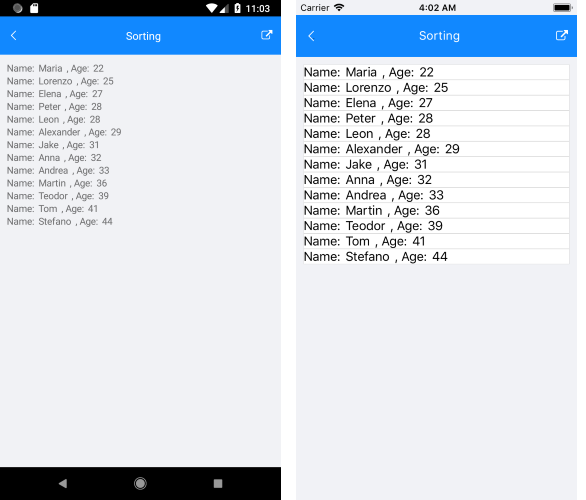
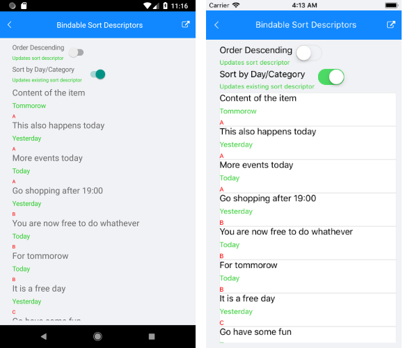

# .NET MAUI ListView Sorting

The ListView can be used to sort the visualized data. This can be achieved by adding different `SortDescriptors` to its `SortDescriptors` collection. There are two types of descriptors shipped with our code.

## PropertySortDescriptor

You can sort the data by a property value from the class that defines your business items. This descriptor exposes the following properties:

- `PropertyName`&mdash;Defines the string name of the property that is used to retrieve the key to sort by.
- `SortOrder`&mdash;Specifies sort order to ascending or descending.

## DelegateSortDescriptor

This descriptor enables you to sort by a custom key (for example, some complex expression combining two or more properties) instead of being limited by the value of a single property. This descriptor exposes the following properties:

- `SortOrder`&mdash;Sets the sort order to ascending or descending.
- `Comparer`&mdash;Defines the `Compare` method used by the internal [IComparer](https://docs.microsoft.com/en-us/dotnet/api/system.collections.icomparer).

### Example

Here is an example that will guide you how to use `SortDescriptor` in the ListView.

**1.** Define the ListView in XAML and add `PropertySortDescriptor` to its `SortDescriptors` collection :

<snippet id='listview-features-sorting-xaml'/>

**2.** Use the following snippet for the `ViewModel` class:

<snippet id='listview-features-sorting-viewmodel'/>

**3.** Define a `Person` class:

<snippet id='listview-features-sorting-data-class'/>

The following image shows the result once the data is sorted.



## Bindable Sort Descriptors

The `SortDescriptors` collection of the ListView supports binding, which means you can modify the sort descriptors directly from the `ViewModel`.

To control the descriptors collections through MVVM:

**1.** Create a property of type `ObservableCollection<SortDescriptorBase>` in your `ViewModel` which will contain the needed sort descriptors:

 <snippet id='listview-features-bindable-sortdescriptor-viewmodel' />

**2.** Use the `OneWayToSource` binding mode to bind that property to the `SortDescriptors` property of ListView. For demonstration purposes, this ListView uses the same `ViewModel` as in the previous example.

```XAML
<telerik:RadListView x:Name="listView"
								 Grid.Row="2"
								 SortDescriptors="{Binding SortDescriptors, Mode=OneWayToSource}"
								 ItemsSource="{Binding Items}">              
	<telerik:RadListView.ItemTemplate>
		<DataTemplate>
			<telerik:ListViewTemplateCell>
				<telerik:ListViewTemplateCell.View>
					<HorizontalStackLayout>
						<Label Text="Name:"/>
						<Label Text="{Binding Name}"/>
						<Label Text=", Age:"/>
						<Label Text="{Binding Age}"/>
					</HorizontalStackLayout>
				</telerik:ListViewTemplateCell.View>
			</telerik:ListViewTemplateCell>
		</DataTemplate>
	</telerik:RadListView.ItemTemplate>
</telerik:RadListView>
```

**3.** According to your preferences, add sort descriptors to the `SortDescriptors` collection in the `ViewModel`, for example:

```C#
private void UpdateExistingSortDescriptor()
{
	if (this.SortDescriptors == null)
		return;

	if (this.SortDescriptors.Count == 0)
	{
		this.SortDescriptors.Add(new PropertySortDescriptor()
		{
			PropertyName = "Day",
			SortOrder = SortOrder.Ascending
		});
	}
}
```


The following image shows the result:



## See Also

- [Grouping]()
- [Filtering]()
- [Selection]()
