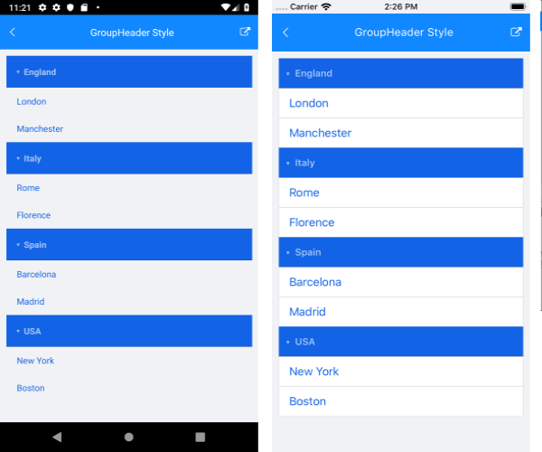

# GroupHeader Style

In addition to the [Item Styles](), the ListView enables you to modify the visual appearance of its group headers when grouping is enabled. The feature is implemented through the `GroupHeaderStyle` property of type `ListViewGroupStyle`.

The `ListViewGroupStyle` provides means for customizing the border as well as background and text color of the group headers. Below you can find a list of the available styling options:

* `BackgroundColor` (`Color`)&mdash;Sets the background of the group header(s).
* `BorderColor` (`Color`)&mdash;Sets the color of the border.
* `BorderWidth` (`double`)&mdash;Defines the width of the borer.
* `BorderLocation` (`Location`)&mdash;Defines an enumeration describing where the border will be visible.
* `TextColor` (`Color`)&mdash;Defines the text color of the ListView `GroupHeader`.

>important To learn more about the grouping functionality of the ListView, refer to the [Grouping Overview]() topic.

### Example

1. Create a `City` class:

 <snippet id='listview-groupstyle-source'/>

1. Add a `ViewModel` class:

 <snippet id='listview-groupstyle-viewmodel'/>

1. Add the `RadListView` definition with a `GroupHeaderStyle` applied:

 <snippet id='listview-groupstyle-listview-xaml' />

The following image shows the end result:

> For a GroupHeader Style example, go to the [SDKBrowser Demo Application]() and navigate to ListView -> Styling category.

## See Also

- [Grouping]()
- [Item Styles]()
- [Items StyleSelector]()
