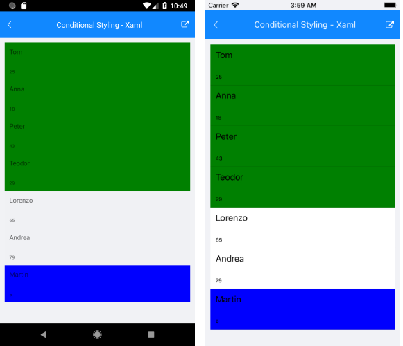

# ItemStyle Selector

The **RadListView** component exposes conditional styling feature. It allows users to apply a different **Style** to each item depending on a specific condition. 


## Example

The following example will demonstrate how to apply the **Conditional Styling** in the RadlistView control.

Lets add the RadlistView component and create a simple data.

Here is an example how to setup the ListView control:

```XAML
 <telerikDataControls:RadListView x:Name="listView" 
                                  ItemsSource="{Binding Source}">
    <telerikDataControls:RadListView.BindingContext>
        <local:ViewModel />
    </telerikDataControls:RadListView.BindingContext>
    <telerikDataControls:RadListView.ItemTemplate>
        <DataTemplate>
            <telerikListView:ListViewTemplateCell>
                <telerikListView:ListViewTemplateCell.View>
                    <StackLayout>
                        <Label Margin="10" Text="{Binding Name}" />
                        <Label Margin="10"
                               FontSize="10"
                               Text="{Binding Age}" />
                    </StackLayout>
                </telerikListView:ListViewTemplateCell.View>
            </telerikListView:ListViewTemplateCell>
        </DataTemplate>
    </telerikDataControls:RadListView.ItemTemplate>

    <telerikDataControls:RadListView.ItemStyleSelector>
        <local:ExampleListViewStyleSelector />
    </telerikDataControls:RadListView.ItemStyleSelector>
</telerikDataControls:RadListView>
```

**2.** Create a simple data for the ListView component:

```C#
public class Person
{
    public Person(string name, int age)
    {
        this.Name = name;
        this.Age = age;
    }

    public string Name { get; set; }

    public int Age { get; set; }
}

public class ViewModel
{
    public ViewModel()
    {
        this.Source = new List<Person> {
            new Person("Tom", 25),
            new Person("Anna",18),
            new Person("Peter",43),
            new Person("Teodor",29),
            new Person("Lorenzo",65),
            new Person("Andrea",79),
            new Person("Martin",5) };
    }

    public List<Person> Source { get; set; }
}
```

**3.** We can set a different style for a specific item using the **ListViewStyleSelector** class. We can use the **OnSelectStyle** method to change the styles of the items in the RadListView control. A sample implementation of a custom class that derives from **ListViewStyleSelector** and overrides its **OnSelectStyle** method is shown below: 

```C#
public class ExampleListViewStyleSelector : ListViewStyleSelector
{
    protected override void OnSelectStyle(object item, ListViewStyleContext styleContext)
    {
        var style = new ListViewItemStyle
        {
            BackgroundColor = Colors.Transparent
        };

        styleContext.ItemStyle = style;
        styleContext.SelectedItemStyle = new ListViewItemStyle
        {
            BackgroundColor = Colors.Gray,
            BorderColor = Colors.Red,
            BorderWidth = 2
        };

        var sourceItem = item as Person;
        if (sourceItem.Age < 18)
        {
            styleContext.ItemStyle.BackgroundColor = Colors.Blue;
        }
        else if (sourceItem.Age < 65)
        {
            styleContext.ItemStyle.BackgroundColor = Colors.Green;
        }
    }
}
```

## Conditional Styling

This is how the **RadListView** control will look like when conditional styling is used.



>important **SDK Browser** application contains an example that shows StyleSelector feature in RadListView cotrol.

## See Also

- [Selection]()
- [Styling]()
- [Reordering]()
