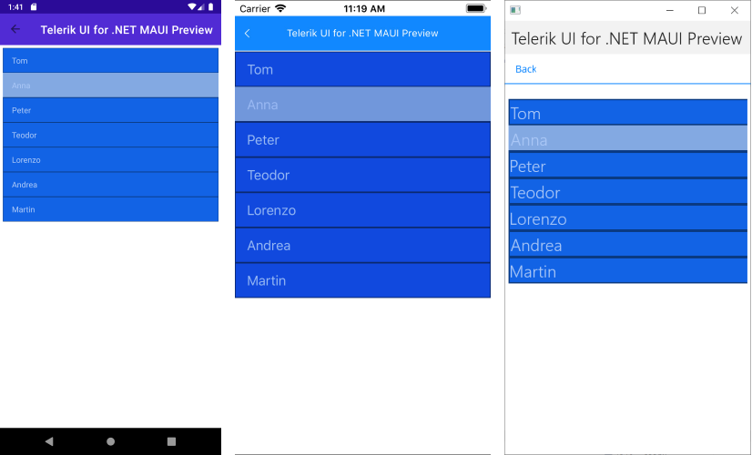
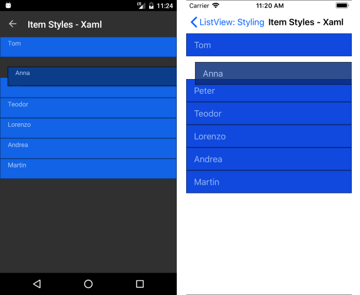

# Item Styles

The ListView component provides styling mechanism for customizing the look of its items.

This mechanism consists of the following properties of type `ListViewItemStyle`:

* `ItemStyle`
* `SelectedItemStyle`
* `PressedItemStyle`
* `ReorderItemStyle`

## ListViewItemStyle

The properties of this object are respectively applied to the native components. The supported ones are the following:

* `BackgroundColor` (`Color`)&mdash;Sets the background of the item(s).
* `BorderColor` (`Color`)&mdash;Sets the color of the border.
* `BorderWidth` (`double`)&mdash;Defines the width of the borer.
* `BorderLocation` (`Location`)&mdash;Describes an enumeration describing where the border will be visible.
* `TextCellTextColor` (`Color`)&mdash;Defines the text color of the ListView `TextCell`.


### Location

This enumeration contains the following members:

- `None`&mdash;The border will not be visualized.
- `Top`&mdash;The border will be visualized only at the top side.
- `Bottom`&mdash;The border will be visualized only at the bottom side.
- `Left`&mdash;The border will be visualized only at the left side.
- `Right`&mdash;The border will be visualized only at the right side.
- (Default) `All`&mdash;The border will be visualized all around the item.

### Example

```XAML
<telerikDataControls:RadListView x:Name="listView"
                                             ItemsSource="{Binding Source}"
                                             IsItemsReorderEnabled="True">
        <telerikDataControls:RadListView.BindingContext>
            <local:ViewModel />
        </telerikDataControls:RadListView.BindingContext>
        <telerikDataControls:RadListView.ItemTemplate>
            <DataTemplate>
                <telerikListView:ListViewTextCell Text="{Binding Name}" />
            </DataTemplate>
        </telerikDataControls:RadListView.ItemTemplate>
        <telerikDataControls:RadListView.ItemStyle>
            <telerikListView:ListViewItemStyle BackgroundColor="#1263E5"
                                    TextCellTextColor="#AAC7F6"
                                    BorderColor="#0A3A82"                                                
                                    BorderWidth="2"
                                    BorderLocation="All" />
        </telerikDataControls:RadListView.ItemStyle>
        <telerikDataControls:RadListView.SelectedItemStyle>
            <telerikListView:ListViewItemStyle BackgroundColor="#83A9E2"
                                    TextCellTextColor="#AAC7F6"
                                    BorderColor="#0A3A82"
                                    BorderWidth="2"
                                    BorderLocation="Bottom"/>
        </telerikDataControls:RadListView.SelectedItemStyle>
        <telerikDataControls:RadListView.PressedItemStyle>
            <telerikListView:ListViewItemStyle BackgroundColor="#C1C1C1"
                                    TextCellTextColor="#AAC7F6"
                                    BorderColor="#0B3D89"
                                    BorderWidth="2"
                                    BorderLocation="Bottom"/>
        </telerikDataControls:RadListView.PressedItemStyle>
        <telerikDataControls:RadListView.ReorderItemStyle>
            <telerikListView:ListViewItemStyle BackgroundColor="#0B3D89"
                                    TextCellTextColor="#AAC7F6"
                                    BorderColor="Black"
                                    BorderWidth="2"
                                    BorderLocation="All" />
        </telerikDataControls:RadListView.ReorderItemStyle>
    </telerikDataControls:RadListView>
```


The following image shows a ListView with its `ItemStyle` and `SelectedItemStyle` applied.




The following image shows a ListView with its `ReorderItemStyle` applied.



>important * For a **ItemStyles** demo, refer to the **ListView/Styling** folder of the [SDK Samples Browser application]().
>* The **ListView/Styling** folder of the SDKBrowser MAUI application contains examples on how you can use those properties as `bindable`.


## See Also

- [Selection]()
- [Reordering]()
- [StyleSelector]()
