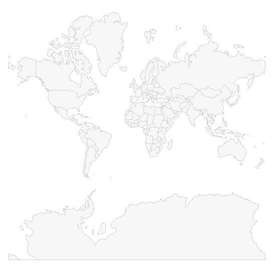

# Getting Started

This guide provides the information you need to start using the Telerik UI for .NET MAUI Map by adding the control to your project.

At the end, you will be able to achieve the following result.



## Prerequisites

Before adding the Map, you need to:

1. [Set up your .NET MAUI application](#set-up-your-net-maui-application).

1. [Download Telerik UI for .NET MAUI](#download-telerik-ui-for-net-maui).

1. [Install Telerik UI for .NET MAUI](#install-telerik-ui-for-net-maui).

>important The Map is rendered through the [SkiaSharp graphics library](https://skia.org/).

## Define the Control

1. When your .NET MAUI application is set up, you are ready to add a Map control to your page.

 <snippet id='map-getting-started-xaml' />
 <snippet id='map-gettingstarted-csharp' />

1. Add the following namespace:

 ```XAML
 xmlns:telerik="http://schemas.telerik.com/2022/xaml/maui"
 ```

1. RadMap uses *.shp files that contain the coordinates of the shapes that will be drawn by the map and an optional *.dbf file for each *.shp file with additional attributes of the shapes.

 You would need to assign the .shp file containing the data through the **Source** property of the MapShapeReader like this:

 <snippet id='map-gettingstarted-setting-source' />

>note In the example the .shp file is loaded as an EmbeddedResource, there are other options as well, please check them in the [ShapefileLayer]() topic.

## See Also

- [ShapefileLayer]()
- [Selection]()
- [Styling]()
