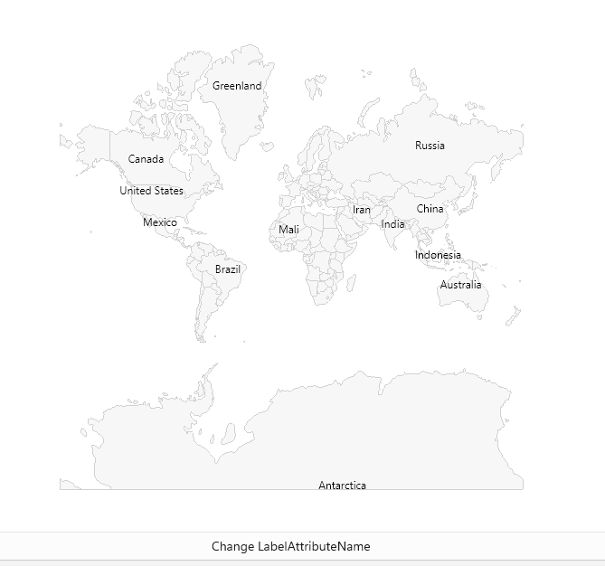

# .NET MAUI Map Shapefile Layer

`MapShapefileLayer` class provides a way to load an ESRI shapefile into the Map and visualize the shapes defined in it. You will need to create a `MapShapefileLayer` for each shapefile and add it to the `Layers` collection of `RadMap`.

## Reading a Shapefile

`MapShapefileLayer` provides a `Reader` property used to read the data from the defined shapefile. The `Reader` is of type `Telerik.Maui.Controls.Map.MapShapeReader` and has two important properties you need to apply to properly load and visualize your shapes:

* `Source` (of type `Telerik.Maui.Controls.Map.MapSource`)&mdash;Gets or sets the `MapSource` that points to the `.shp` file to read data from. 
* `DataSource` (of type `Telerik.Maui.Controls.Map.MapSource`)&mdash;Gets or sets the `MapSource` that points to the `.dbf` file, containing the data(or attributes) for each shape within the shape file. 

The above used `MapSource` class provides a few useful static methods that will help load the shapefile:

* `FromResource(string resource, Assembly sourceAssembly)` / `FromResource(string resource, Type resolvingType)`: Two overrides you can choose from to create `MapSource`from a provided embedded resource. 

* `FromStream(Stream stream)`&mdash;Returns a `MapSource` from a passed stream.
* `FromFile(string file)`&mdash;Returns `MapSource` from a passed string the represents a specific file path.

In addition, `MapShapeReader` provides a read-only `Shapes` property that can be used to get a list of all the shapes that are read from the Source. 

## Getting Best View

`MapShapefileLayer` provides a way to visualize the shapes in such a way that the best view of the layer is achieved. The approach is implemented through the `GetBestView` method:

* `GetBestView()` (`struct` of type `Telerik.Maui.Controls.ShapefileReader.LocationRect`)&mdash;Gets location rectangle which represents best view for the layer.

First, `LocationRect` class is a special type from the `Telerik.Maui.Controls.ShapefileReader` namespace which describes a rectangle region through the locations of the northwest to the southeast points.  

>tip For more details on how points are positioned in the geographic coordinate system, check [Layers Overview]() topic. 

So, through `GetBestView` method the map will calculate that region that encompasses all the shapes as well as apply proper zoom level, so that the best view is achieved. After that, you can pass the result directly to the `SetView` method of the Map instance like this:

<snippet id='map-setbestview-code' />

## Labels

You can add a label for each shape in a `MapShapefileLayer` by setting the `LabelAttributeName` property to an attribute from the `.dbf` file specified in the DataSource property of the layer.

Check below a quick example:

<snippet id='map-labels-xaml' />

where the `Source` and the `DataSource` of the `MapShapeReader` have to be defined to a `.shp` and `.dbf` files, respectively:

<snippet id='map-labels-settintsource' />

## Selection

`RadMap` supports single and multiple selection of shapes to help you draw attention on specific areas. You will need to set `SelectionMode` property of the `ShapefileLayer` to enable the selection. 

`SelectionMode` can receive the following values:

* None;
* Single;
* Multiple.

Read the [Selection]() topic for more details about this feature.

## Styling

`RadMap` provides the option to apply various Fill and Stroke colors to the shapes to make the map consecutive with the design of the app. For more details check [Styling]() article. 

## See Also

- [Selection]()
- [Styling]()
