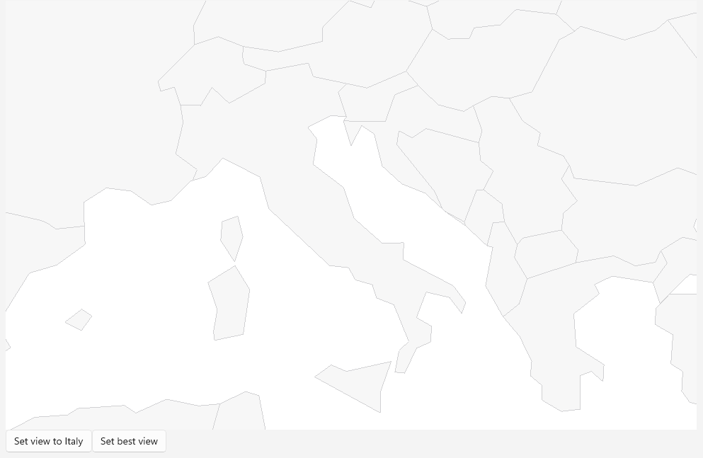

# Pan and Zoom

Telerik UI for .NET MAUI Map provides pan and zoom functionality that will help you interact with the view and inspect your data. The Map control handles the gestures drag, pinch-open and pinch-close which respectively cause panning, zooming-in and zooming-out of the associated plot area.

## Interaction Modes

You can configure which gesture manipulations the user can do with the map through the enum `InteractionMode` property. `InteractionMode` can receive the following values:

* None: No interaction is allowed;
* Pan; 
* Zoom;
* PanAndZoom (default value).

Here is a quick snippet how `InteractionMode` isd applied:

<snippet id='map-interaction-mode-xaml' />

where the Source of the MapShapeReader should be defined as well:

<snippet id='map-interactionmode-settintsource' />

>note In the example the .shp file is loaded as an EmbeddedResource, there are other options as well, please check them in the [ShapefileLayer]() topic.

## Zoom Level Support

The Map exposes properties for applying min and max zoom values.

* `MaxZoomLevel`: Defines the maximum magnification factor at which content could be maximized. The default value is 20.0
* `MinZoomLevel`: Defines the minimum magnification factor at which content could be minimized. The default value is 1.0

You can check the current magnification through the readonly `ZoomLevel` property.

<snippet id='map-zoom-level-xaml' />

In addition, you can use the method below to set the provided zoom value as the current zoom level of the map:

* `ZoomToLevel`(double zoomLevel);

## Setting the View

If you would like to show a specific area from the map, you can use `SetView` method as described below:

* `SetView`(LocationRect locationRect) – Sets the provided location as the current view of the map. 

`LocationRect` class is a special type from the *Telerik.XamarinForms.ShapefileReader* namespace, which describes a rectangle region through the locations of the northwest and southeast points.  

>tip For more details on how points are positioned in the geographic coordinate system, check [Layers Overview]() topic. 

Here is an example how you could utilize `SetView` method (in the example the used latitude and longitude values are chosen to form a region around Italy):

<snippet id='map-setview-code' />

## See Also

- [Layers]()
- [Selection]()
- [Styling]()
