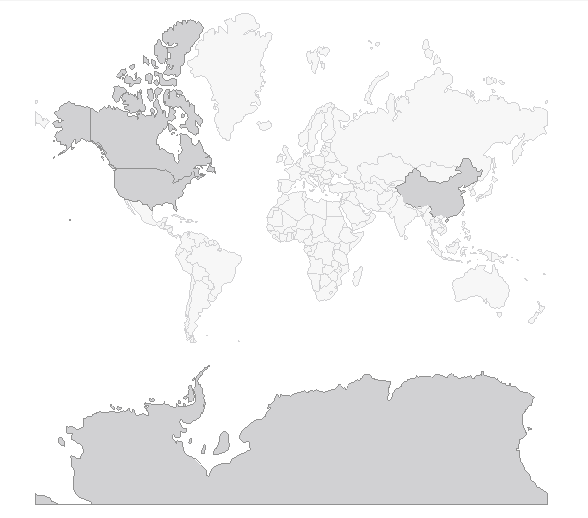

# .NET MAUI Map Selection

The Map allows users to select one or many shapes out of the source applied by each `MapShapefileLayer`. This feature provides both visual and programmatic feedback for the actions of the user. 

The following members of the [ShapefileLayer]() class are related to the selection: 

* `SelectionMode` (`enum` of type `MapSelectionMode`)—Indicates the selection mode. The options are:
	* `None`
	* `Single`
	* `Multiple`

* `SelectedShape` (of type `IShape`)—Defines the currently selected shape instance. When multiple selection is enabled, this value is set to the first selected shape. 

* `SelectedShapes` (read-only collection of type `ObservableCollection<IShape>`)—Reads the collection with the currently selected shapes. When the selection is `Single`, only one shape can be selected–thus the collection will have count = 1.

* `SelectedShapeStyle` (of type `MapShapeStyle`): Defines the way selected shape look through the provided `StrokeWidth`, `StrokeColor` and `FillColor` properties. For more details on the `MapShapeStyle` usage go to [Shapes Styling]() topic.

Define `RadMap` with `SelectionMode`:

<snippet id='map-selection-mode-xaml' />

Where the `Source` and the `DataSource` of the `MapShapeReader` have to be set to a `.shp` and `.dbf` files, respectively:

<snippet id='map-selection-settintsource' />

Add the namespace:

```XAML
xmlns:telerik="http://schemas.telerik.com/2022/xaml/maui"
```

Check below how `RadMap` with a few selected shapes will look like:


## Example with Programmatical Shape Selection

The snippet below demonstrates how you can select a shape programmatically. In the example the used ESRI file contains the world map, so the shape that is selected is a country. The example uses the `Shapes` property of the Map to traverse through all the available shapes.

Let's select/deselect "France", for example, on clicking buttons:

<snippet id='map-selectshapes-xaml' />

And the event handlers:

<snippet id='map-selection-runtime-code' />

```XAML
xmlns:telerik="http://schemas.telerik.com/2022/xaml/maui"
```

Here is the result:



>note A sample Programmatic Selection example can be found in the Map/Selection folder of the [SDK .NET MAUI Demo application]().

## See Also

- [ShapefileLayer]()
- [Shapes Styling]()

