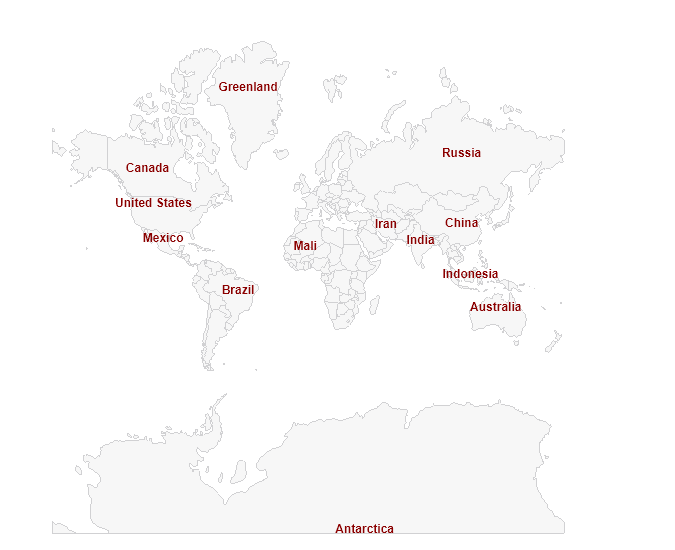

# .NET MAUI Map Label Styling

The Map `ShapefileLayer` has a `ShapeLabelStyle` property that is of `MapShapeLabelStyle` type and defines the style of the labels.

MapShapeLabelStyle provides the following properties you could use to customize the way labels on the map will look:

* `TextColor`
* `FontSize`
* `FontFamily`
* `FontAttributes`

The example shows the ShapeLabelStyle property applied:

<snippet id='map-styling-shapelabelstyle' />

where the `Source` and the `DataSource` of the MapShapeReader should be set to a .shp and .dbf files, respectively:

<snippet id='map-interactionmode-settintsource' />

And the used namespace:

```XAML
xmlns:telerik="http://schemas.telerik.com/2022/xaml/maui"
```

Here is the result:



## See Also

- [ShapefileLayer]()
- [Shapes Styling]()
