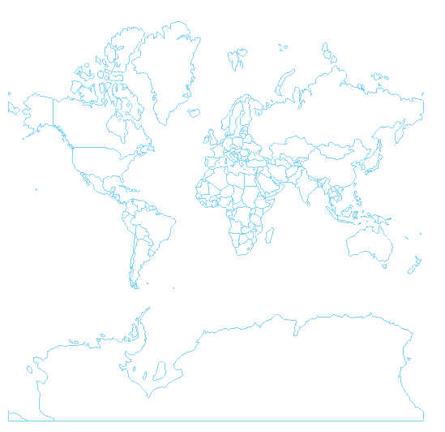
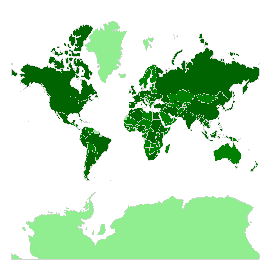

# Shapes Styling

The Map `ShapefileLayer` exposes `ShapeStyle` property which helps you to style the shapes, as well as the selected shapes using the `SelectedShapeStyle` proeprty. A conditional styling is applied using the `ShapeStyleSelector` proeprty.

## Shapes Styles

`ShapeStyle` and `SelectedShapeStyle` properties of type( `MapShapeStyle`) provides the following styling options for the shapes:

* `StrokeWidth`
* `StrokeColor`
* `FillColor`

The snippet below shows how ShapeStyle property can be applied:

<snippet id='map-styling-shapeslstyle' />

Here is the result:



where the `Source` and the `DataSource` of the MapShapeReader should be set to a .shp and .dbf files, respectively:

<snippet id='map-interactionmode-settintsource' />

## Style Selector for Shapes

Using the `ShapeStyleSelector` property of the `ShapefileLayer` you could implement conditional styling. 

The example below shows how to apply different styles to shapes according to certain property value of each shape.

1. First, create the selector class which inherit from `MapShapeStyleSelector`:

 <snippet id='map-shapesstyleselector-code' />

1. Define the selector with the Styles as a resource inside a ResourceDictionary:

 <snippet id='map-styling-shapeslstyleselector-styles' />

1. Add the definition of the RadMap control with the PopulationShapeStyleSelector applied;

 <snippet id='map-styling-shapeslstyleselector-xaml' />

1. Add the namespace:

 ```XAML
xmlns:telerik="http://schemas.telerik.com/2022/xaml/maui"
 ```

Check the result in the screenshot below:



## See Also

- [ShapefileLayer]()
- [Labels Styling]()
