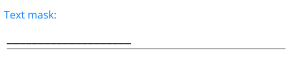

# Text Mask

To validate the user input as text symbols, use the `TextMaskedEntry`. The resulting value is a string object.

The table below lists the mask characters that can be used with `TextMaskedEntry`. The characters can be set to the `Mask` property.

| **Mask Character** | **Description** |
|----|----|
|`0`|(Required) Digit. This element will accept any single digit between 0 and 9.|
|`9`|(Optional) Digit or space.|
|`#`|(Optional) Digit or space. If this position is blank in the mask, it will be rendered as the character in the [`PromptChar`]() property. For example, `"$######.##"` displays as a literal `"$"`, accepts a numeric amount with six places and two places to the right of the decimal, that is, `$123456.56`.|
|`L`|(Required) Accepts letters only.|
|`?`|(Optional) Letter.|
|`&`|(Required) Character.|
|`C`|(Optional) Character.|
|`A`|(Required) Alphanumeric. Accepts any symbol.|
|`a`|(Optional) Alphanumeric.|
|`.`|Decimal placeholder.|
|`,`|Thousands placeholder.|
|`:`|Time separator.|
|`/`|Date separator.|
|`$`|Currency symbol.|
|`<`|Shifts down. Converts all characters that follow to lowercase.|
|`>`|Shifts up. Converts all characters that follow to uppercase.|
|`\`|Disables a previous shift up or shift down.|
|`\\`|Escape. Escapes a mask character, turning it into a literal. `"\\"` is the escape sequence for a backslash.|
|All other characters|All non-mask elements will appear as themselves within `RadTextMaskedEntry`. Literals always occupy a static position in the mask at run time, and cannot be moved or deleted by the user.|

The following example demonstrates how to create a `RadTextMaskedEntry`:

<snippet id='textmaskedentry-getting-started-xaml' />

The image below shows the end result.

> For the MaskedEntry Text Mask examples, go to the [SDKBrowser Demo Application]() and navigate to MaskedEntry -> Mask Types category.

## See Also

- [Getting Started]()
- [Validation]()
- [Null Values Support](#null-value-support})
- [Events]()
- [Globalization]()
