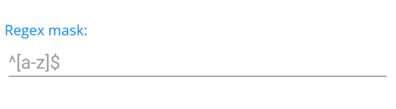

# Getting Started with the Telerik UI for .NET MAUI MaskedEntry

This guide provides the information you need to start using the Telerik UI for .NET MAUI MaskedEntry by adding the control to your project.

At the end, you will be able to achieve the following result.



## Prerequisites

Before adding the MaskedEntry, you need to:

1. [Set up your .NET MAUI application](#set-up-your-net-maui-application).

1. [Download Telerik UI for .NET MAUI](#download-telerik-ui-for-net-maui).

1. [Install Telerik UI for .NET MAUI](#install-telerik-ui-for-net-maui).

## Define the Control

1. When the your .NET MAUI application is set up, you are ready to add a MaskedEntry control to your page. The following example demonstrates the definition of the `RadRegexMaskedEntry` with the `Mask` and `PlaceholderText` properties applied.

 ```XAML
<telerik:RadRegexMaskedEntry x:Name="regexMaskedEntry" Mask="^[a-z]$" PlaceholderText="^[a-z]$" />
 ```

1. Add the following namespace:

 ```XAML
xmlns:telerik="clr-namespace:Telerik.Maui.Controls;assembly=Telerik.Maui.Controls"
 ```

## See Also

- [Types of Masks]()
- [MaskedEntry Events]()
