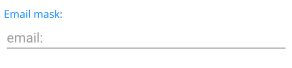
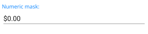
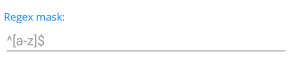
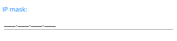

# Masks

The MaskedEntry provides a number of mask types, which enable you to restrict user input to a specific type such as email, text, and more.

## Email Mask

To validate the user input as an email entry, use the `EmailMaskedEntry`. The resulting value is a string object.

To enable the email mask type, set the `RadEmailMaskedEntry` instance:

```XAML
<telerik:RadEmailMaskedEntry x:Name="emailMaskedEntry" />
```


The following image shows the end result.



## Numeric Mask

To validate the user input as numeric values, use the `NumericMaskedEntry`.

The numeric mask displays the following values:

* Percent values.
* Decimal values.
* Currency (culture-aware).
* Fixed point values.

Through the `Mask` property you can specify the exact format of the expected input. The following example demonstrates how to set the `RadNumericMaskedEntry` with the `Currency` value.

```XAML
<telerik:RadNumericMaskedEntry x:Name="numericMaskedEntry" Mask="C" />
```


The following image shows the end result.



## Regex Mask

To validate the user input as a standard (alphanumeric) user input against a regular expression, use the `RegexMaskedEntry`, which provides errors if the regular expression (regex) rule is not matched. The resulting value is a string.

The following example demonstrates how to set the `RadRegexMaskedEntry`.

```XAML
<telerik:RadRegexMaskedEntry x:Name="regexMaskedEntry" Mask="^[a-z]$" PlaceholderText="^[a-z]$" />
```


The following image shows the end result.



## IP Mask

To validate the user input as an IP Address input, use the `IPMaskedEntry`. The resulting value is a string object.

The following example demonstrates how to create a `RadIPMaskedEntry`.

```XAML
<telerik:RadIPMaskedEntry x:Name="ipMaskedEntry" />
```


The following image shows the end result.



## Text Mask

To validate the user input as text symbols, use the `TextMaskedEntry`. The resulting value is a string object.

The following example demonstrates how to create a `RadTextMaskedEntry`.

```XAML
<telerik:RadTextMaskedEntry x:Name="textMaskedEntry" Mask="aaaaaaaaaaaaaaaaaaaa" />
```


The following image shows the end result.


## See Also

- [Getting Started]()
- [Events]()
