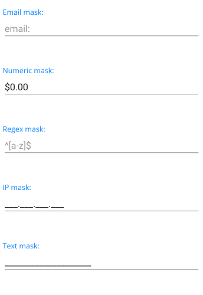

# Overview

**Telerik MaskedEntry for .NET MAUI** formats and constrains text to a predefined pattern or a pattern you define. It provides input validation and masks, such as Text, Regex, IP , Email and Numeric.

## Key features

* [Rich set of mask types](): The masked input control allows you to use different type of masks depending on our scenario.

* **Setting Mask**: Allows you to define a string of characters that constrain user input. The `Mask` property may contain literals and special mask characters based on the used RadMaskedEntry -> Regex, Numeric, etc. 

* **Returns the user input without the formatting characters** using the `Value` proeprty.

* **Keyboard Support**: In addition to the standard keyboard input, the RadMaskedEntry controls deliver the convenience of desktop applications with support for arrow-key navigation for desktop apps.

## Next Steps

- [Getting Started with Telerik UI for .NET MAUI MaskedEntry]()

