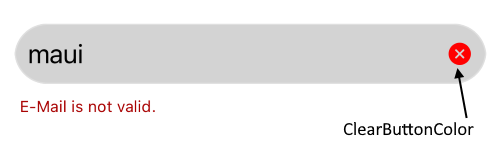
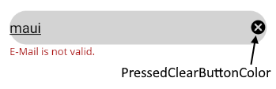
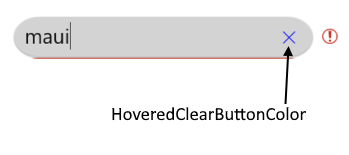

# Styling

This article explains all styling options you can apply to the MaskedEntry control. The properties are valid for all mask types.

The `MaskedEntryBase` class exposes the following properties: 

* `TextColor`(`Microsoft.Maui.Graphics`)&mdash;Defines the color of the text inside the masked entry.
* `EntryCornerRadius`(`Microsoft.Maui`)&mdash;Defines the corner radius around the masked entry 
* `EntryBackgroundColor`(`Microsoft.Maui.Graphics`)&mdash;Defnes the bacground color of the masked entry
* `BackgroundColor`(`Microsoft.Maui.Graphics`)&mdash;Defines the background color of the masked control.
* `ClearButtonColor`(`Microsoft.Maui.Graphics`)&mdash;Defines the color of the clear button.
* `HoveredClearButtonColor`(`Microsoft.Maui.Graphics`)&mdash;Defines the color of the clear button when it is hovered. The color appears only on desktop.
* `PressedClearButtonColor`(`Microsoft.Maui.Graphics`)&mdash;Defines the color of the clear button when it is pressed.

## Example

We will style the `EmailMaskedEntry`. Here is the XAML definition:

<snippet id='maskedentry-styling-xaml' />

Add the namespace:

```XAML
xmlns:telerik="clr-namespace:Telerik.Maui.Controls;assembly=Telerik.Maui.Controls"
```


**ClearButtonColor**



**PressedClearButtonColor**



**HoveredClearButtonColor**



>tip For the **Styling** example, refer to the **MaskedEntry/Features** folder of the [SDK .NET MAUI Application]().

## See Also

- [Mask Types]()
- [Validation]()
- [Events]()
- [Globalization]()
