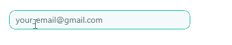

# .NET MAUI MaskedEntry Styling

The MaskedEntry control delivers a set of options for styling its appearance.

The `MaskedEntryBase` class exposes the following properties, which are valid for all mask types.:

* `TextColor`(`Microsoft.Maui.Graphics`)&mdash;Defines the color of the text inside the MaskedEntry.
* `EntryCornerRadius`(`Microsoft.Maui`)&mdash;Defines the corner radius around the MaskedEntry.
* `EntryBackgroundColor`(`Microsoft.Maui.Graphics`)&mdash;Defines the background color of the MaskedEntry.
* `BackgroundColor`(`Microsoft.Maui.Graphics`)&mdash;Defines the background color of the masked control.
* `ClearButtonStyle` (`Style` with a target type of `Telerik.Maui.Control.RadTemplatedButton`)&mdash;Defines the style of the clear button.

The following example demonstrates how to style the `EmailMaskedEntry`. 

**1.** Define the control in XAML:

<snippet id='maskedentry-styling-xaml' />

**2.** Define the resource for the `ClearButtonStyle` to the page's resource:

<snippet id=' maskedentry-styling-clearbutton' />

**3.** Add the `telerik` namespace:

```XAML
xmlns:telerik="clr-namespace:Telerik.Maui.Controls;assembly=Telerik.Maui.Controls"
```

This is the result on WinUI:



> For the MaskedEntry Styling example, go to the [SDKBrowser Demo Application]() and navigate to the **MaskedEntry > Features** category.

## See Also

- [Mask Types]()
- [Validation]()
- [Events]()
- [Globalization]()
