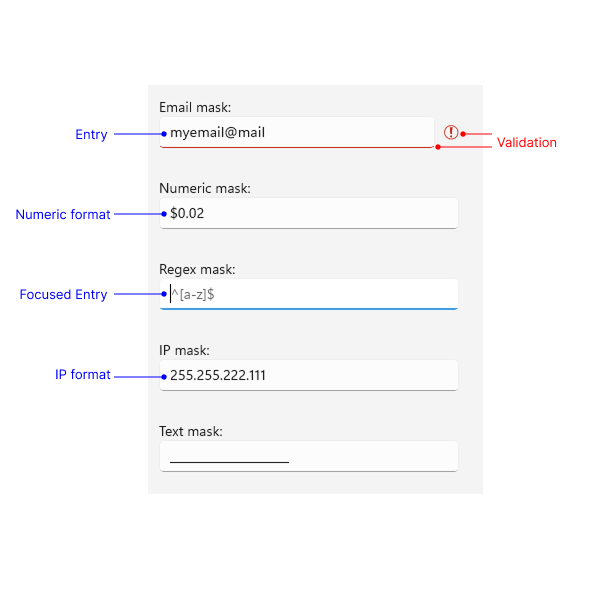

# .NET MAUI MaskedInput Visual Structure

The visual structure of the .NET MAUI MaskedInput represents the anatomy of the UI component. Being familiar with the visual elements of the MaskedInput allows you to quickly find the information required to configure them.

The following image shows the anatomy of the MaskedInput.

## Displayed Elements

* **Entry**&mdash;The main element of the MaskedInput that displays the masked text and allows user input.
* **Validation**&mdash;The visual indication that the current input is invalid.
* **Different formats, like IP, Numeric**&mdash;The MaskedInput supports different mask types that define the format of the input.

## See Also

- [Mask Types]()
- [Value Format]()
- [Validation]()
- [Null Values Support](#null-value-support})
- [Prompt Character]()
- [Events]()
- [Globalization]()
