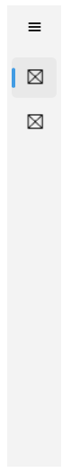
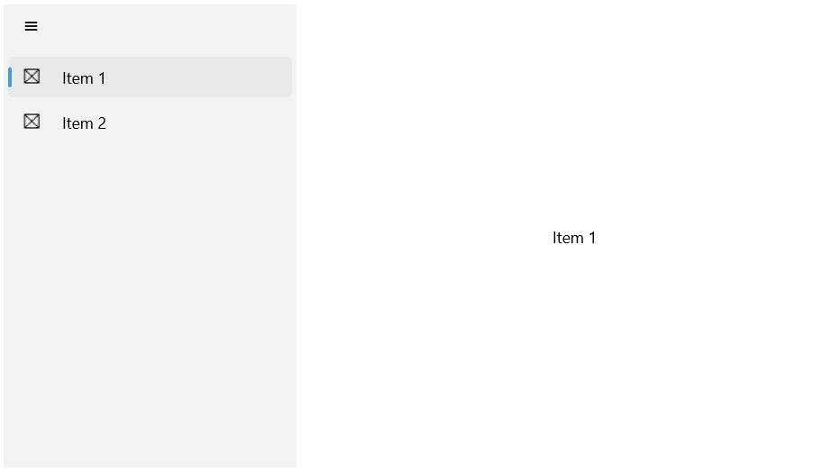

# .NET MAUI NavigationView Display Mode

The NavigationView provides three layouts based on its `DisplayMode` (enum of type `Telerik.Maui.Controls.NavigationViewDisplayMode`) property. The available options are:

* `Minimal`&mdash;This option fixes the menu button. The pane shows and hides when the menu button is clicked.
* `Compact`&mdash;The pane always shows as a narrow sliver which can be opened to full width.
* `Expanded`&mdash;The pane stays open alongside the content.

## Auto-changing the Display Mode

The NavigationView dynamically adjusts its layout depending on its size. This is controlled with the `AutoChangeDisplayMode` (`bool`) property. On desktop its value is `true`, on mobile `false`.

In addition use the following properties for setting the minimum width at which the NavigationView enters the `Compact` and `Expanded` display modes: 

* `ExpandedModeThresholdWidth` (`double`)&mdash;Specifies the minimum width at which the NavigationView enters Expanded display mode.
* `CompactModeThresholdWidth` (`double`)&mdash;Specifies the minimum width at which the NavigationView enters Compact display mode.

### Example with DisplayMode Minimal

**1.** Define the `RadNavigationView` in XAML:

<snippet id='navigationview-displaymide-minimal'/>

**2.** Add the `telerik` namespace:

```XAML
xmlns:telerik="http://schemas.telerik.com/2022/xaml/maui"
```

Here is how the `Minimal` `DisplayMode` looks:


> For the runnable NavigationView Minimal DisplayMode example, see the [SDKBrowser Demo Application]() and go to **NavigationView > Features category**.

### Example with DisplayMode Compact

**1.** Define the `RadNavigationView` in XAML:

<snippet id='navigationview-displaymide-compact'/>

**2.** Add the `telerik` namespace:

```XAML
xmlns:telerik="http://schemas.telerik.com/2022/xaml/maui"
```

Here is how the `Compact` `DisplayMode` looks:



> For the runnable NavigationView Compact DisplayMode example, see the [SDKBrowser Demo Application]() and go to **NavigationView > Features category**.

### Example with DisplayMode Expanded

**1.** Define the `RadNavigationView` in XAML:

<snippet id='navigationview-displaymide-expanded'/>

**2.** Add the `telerik` namespace:

```XAML
xmlns:telerik="http://schemas.telerik.com/2022/xaml/maui"
```

Here is how the `Expanded` `DisplayMode` looks:



> For the runnable NavigationView Expanded DisplayMode example, see the [SDKBrowser Demo Application]() and go to **NavigationView > Features category**.

## See Also

- [Selecting an item]()
- [Configure the Navigation Pane]()
- [Configure the Navigation Item]()
- [Configure the Navigation Header]()
- [Navigation Item Styling]()
- [Navigation Pane Styling]()
- [Navigation Header Styling]()
- [Events]()
- [Commands]()
