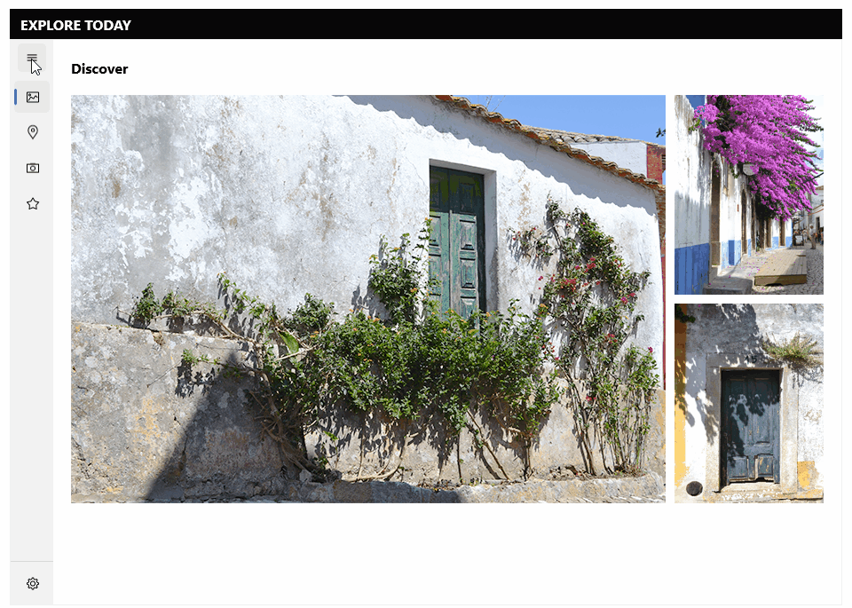

# .NET MAUI NavigationView Overview

The Telerik UI for .NET MAUI NavigationView is an adaptive control, used to build a consistent navigational experience in .NET MAUI applications. The navigation items are rendered in a vertical layout. You can take advantage of the different options for displaying the navigation pane; adding header and footer to the pane and customize its look.

## Key features

* [Display modes]()&mdash;Use different modes to display the navigation pane&mdash;Compact, Expanded and Minimal modes. 
* [Auto-changing the Display mode]()&mdash;Option for auto-changing the display mode depending on the threshold width.
* [Navigation Header]()&mdash;NavigationView has a navigation header that contains label and toggle navigation button that opens/closes the pane.
* [Navigation Pane]()&mdash;The pane that holds the navigation items, pane header and footer.
* [Pane Header and Footer]()&mdash;NavigationView allows you to add navigation items in the header and in the footer. 
* Content&mdash;NavigationView allows you to add content. You need to manually change the content based on the selection made. 
* [Single Selection]()&mdash;You can set selection through the `SelectedItem` property.
* [Customizable items]()&mdash;You can customize the visual appearance of the Navigation items.
* [Styling options]()&mdash;NavigationView allows you to style header, footer, navigation header and navigation items.
* [Commands support]()&mdash;NavigationView allows you to attach commands that will be executed when opening, closing the pane.

# Next Steps

- [Getting Started with Telerik UI for .NET MAUI NavigationView]()

## See Also

- [.NET MAUI NavigationView Product Page](https://www.telerik.com/maui-ui/navigationview)
- [.NET MAUI NavigationView Forum Page](https://www.telerik.com/forums/maui?tagId=1978)
- [Telerik .NET MAUI Blogs](https://www.telerik.com/blogs/mobile-net-maui)
- [Telerik .NET MAUI Roadmap](https://www.telerik.com/support/whats-new/maui-ui/roadmap)
