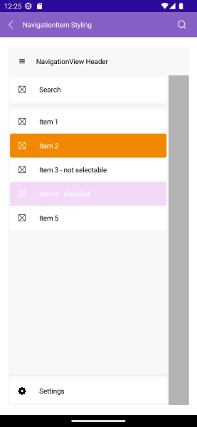

# .NET MAUI NavigationItem Styling

Style the navigation item, by setting the `Style` property to the `NavigationViewItem` or use implicit style.

The image below shows sample navigation item styling:



* Explicit style:

```XAML
<ContentView.Resources>
    <ResourceDictionary>
        <Style TargetType="telerik:NavigationViewItemView" x:Key="NavigationItemStyle">
            <Setter Property="Spacing" Value="10"/>
        </Style>
    </ResourceDictionary>
</ContentView.Resources>

<telerik:NavigationViewItem Text="Item 1" Style="{StaticResource NavigationItemStyle}" />
```

* Implicit style:

```XAML
<Style TargetType="telerik:NavigationViewItemView">
   <Setter Property="Spacing" Value="10"/>            
</Style>
```

The available properties are described in the table below:

| Property | Description |
| -------- | ----------- |
| `Command` (`ICommand`) | Executed when the navigation item is clicked. |
| `CommandParameter` (`object`) | Specifies a parameter to command which is executed when the navigation item is clicked. |
| `IsSelectable` (`bool`) | Specifies whether the navigation item is selectable. |
| `IsSelected` (`bool`) | Specifies whether the navigation item is selected. |
| `ImageSource` (`ImageSource`) | Specifies the source of the image that is displayed in the navigation item. |
| `ImageAspect` (`Microsoft.Maui.Aspect`) | Specifies the aspect ratio of the image that is displayed in the navigation item. |
| `ImageWidth` (`double`) | Specifies the width in pixels of the image that is displayed in the navigation item. |
| `ImageHeight` (`double`) | Specifies the height in pixels of the image that is displayed in the navigation item. |
| `Spacing` (`double`) | Specifies the spacing in pixels between the image area and the content of the navigation item. |

## Example

Here is an example how to define visual states to the navigation item and style the elements:

**1.** Define the `RadNavigationView`:

<snippet id='navigationview-item-styling' />

**2.** Define the `VisualStates` for the NavigationViewItem:

<snippet id='navigationview-item-element-styling' />

**3.** Add the `telerik` namespace:

```XAML
xmlns:telerik="http://schemas.telerik.com/2022/xaml/maui"
```

> For the runnable NavigationView Item Styling example, see the [SDKBrowser Demo Application]() and go to **NavigationView > Styling category**.

## See Also

- [Configure the Navigation Pane]()
- [Configure the Navigation Item]()
- [Configure the Navigation Header]()
- [Navigation Pane Styling]()
- [Navigation Header Styling]()
