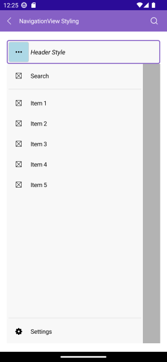

# .NET MAUI NavigationView Styling

The NavigationView for .NET MAUI provides a styling mechanism for customizing its header-including the navigation header and navigation toggle button, [navigation pane]() and [navigation items]().

## Styling the NavigationView Header

The NavigationView Header for .NET MAUI provides a styling mechanism for customizing its look and the look of the toggle navigation button.
To use it, set the `HeaderStyle` property of the control with a target type `NavigationViewHeader`.

The image below shows sample navigation header styling:

The available properties are described in the table below:

| Property | Description |
| -------- | ----------- |
| `FontFamily` (`string`) | Specifies the font family of the container in compact mode. |
| `FontSize` (`double`) | Specifies the font size in pixels of the displayed text. |
| `FontAttributes` (`Microsoft.Maui.Control.FontAttributes`) | Specifies the font attributes of the displayed text |
| `TextDecorations` (`Microsoft.Maui.TextDecorations`) | Specifies the text decorations of the displayed text. |
| `LineBreakMode` (`Microsoft.Maui.LineBreakMode`) | Specifies the line break mode of the displayed text. |
| `HorizontalTextAlignment` (`Microsoft.Maui.TextAlignment`) | Specifies the horizontal alignment of the displayed text. |
| `VerticalTextAlignment` (`Microsoft.Maui.TextAlignment`) | Specifies the vertical alignment of the displayed text. |
| `HorizontalContentOptions` (`Microsoft.Maui.Controls.LayoutOptions`) | Specifies the horizontal layout options of the displayed content. |
| `VerticalContentOptions` (`Microsoft.Maui.Controls.LayoutOptions`) | Specifies the vertical layout options of the displayed content. |
| `BackgroundColor` (`Color`) | Specifies the background color of the header area. |
| `BorderColor` (`Color`) | Specifies the border color around the header area. |
| `BorderBrush` (`Brush`) | Specifies the border brush around the header area. |
| `BorderThickness` (`Thickness`) | Specifies the border thickness around the header area. |
| `CornerRadius` (`Thickness`) | Specifies the corner radius of the border around the header area. |
| `ContentPadding` (`Thickness`) | Specifies the content padding of the header area. |
| `CompactWidth` | Specifies the width of the container in compact mode. |
| `ExpandedWidth` | Specifies the width of the container in expanded mode. |
| `IsHeaderButtonVisible` (`bool`) Default value `true` | Specifies the visibility of the navigation toggle button. |
| `IsHeaderButtonToggled` (`bool`) | Specifies whether the navigation button is toggled. |
| `HeaderButtonStyle` (`Style` with a target type of `NavigationViewToggleButton`) | Specifies the style that will be applied to the navigation toggle button. |

Here is a sample header styling definition:

<snippet id='navigationview-header-styling' />

> For the runnable NavigationView Header Styling example, see the [SDKBrowser Demo Application]() and go to **NavigationView > Styling category**.

## Styling the Navigation Toggle Button 

You can style the toggle button by setting the `HeaderButtonStyle` property to the `HeaderStyle`. The target type of the `HeaderButtonStyle` is `NavigationViewToggleButton`.

`NavigationViewToggleButton` inherits from [Telerik .NET MAUI Button]() control. Use all properties applicable for the `RadButton` to style the Toggle Button.

### Visual States

You can customize the visual states to the `NavigationViewToggleButton`. Here is a sample XAML definition with visual states:

<snippet id='navigationview-togglebutton-styling' />

> For the runnable NavigationView Header Styling example, see the [SDKBrowser Demo Application]() and go to **NavigationView > Styling category**.

## Styling the Overlay

You can display an overlay when the Pane opens by setting the `IsDismissOverlayVisible` (`bool`) property. The default value is `false`.

You can style the overlay by using the following properties:

* `DismissOverlayBrush` (`Brush`)&mdash;Specifies the brush for the overlay.
* `DismissOverlayColor` (`Color`)&mdash;Specifies the color for the overlay.

## See Also

- [Configure the Navigation Pane]()
- [Configure the Navigation Item]()
- [Configure the Navigation Header]()
- [Navigation Item Styling]()
- [Navigation Pane Styling]()
