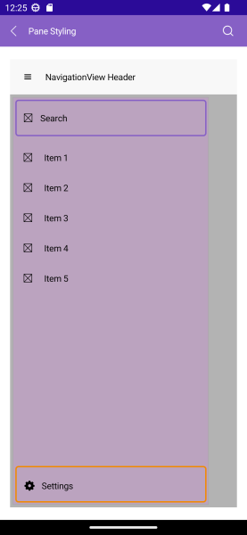

# .NET MAUI NavigationView Pane Styling

The NavigationView Pane for .NET MAUI provides a styling mechanism for customizing its look, as well as the look of its header and footer.
To use it, set the `PaneStyle` property of the control with a target type `NavigationViewPane`.

The image below shows sample pane styling:

The available properties are described in the table below:

| Property | Description |
| -------- | ----------- |
| `ItemSpacing` (`double`) | Specifies the spacing between the items in the pane. |
| `DisplayMode` (enum of type `Telerik.Maui.Controls.NavigationViewDisplayMode`) | Specifies how the pane displays the navigation items - `Minimal`, `Compact` or `Expanded`. |
| `IsOpen` (`bool`) | Specifies whether the navigation pane is open. |
| `CompactWidth` (`double`) | Specifies the width of the navigation pane in compact mode. |
| `ExpandedWidth` (`double`) | Specifies the width of the navigation pane in expanded mode. |
| `HeaderStyle` (`Style` with a target type of `NavigationViewPaneHeader`) | Specifies the style applied to the Pane header. |
| `HeaderTemplate` (`ControlTemplate`) | Replaces the default header template with a custom template. |
| `FooterStyle` (`Style` with a target type of `NavigationViewPaneFooter`) | Specifies the style applied to the Pane header. |
| `FooterTemplate` (`ControlTemplate`) | Replaces the default header template with a custom template. |
| `VerticalScrollBarStyle` (`Style` with a target type of `RadScrollBar`) | Specifies the style for the vertical scroll bar. |
| `VerticalScrollBarTemplate` (`ControlTemplate`) | Specifies the template of the vertical scroll bar. |
| `VerticalScrollBarVisibility` (`Microsoft.Maui.ScrollBarVisibility`) | Specifies the visibility of the vertical scroll bar. The available options are - `Default`, `Always`, and `Never`. |
| `BackgroundColor` (`Color`) | Specifies the background color of the pane. |
| `BorderColor` (`Color`) | Specifies the border color of the pane. |
| `BorderBrush` (`Brush`) | Specifies the border brush of the pane. |
| `BorderThickness` (`Thickness`) | Specifies the border thickness of the pane. |
| `CornerRadius` (`Thickness`) | Specifies the corner radius of the border around the pane. |
| `ContentPadding` (`Thickness`) | Specifies the content padding of the control. |

Here is an example with `PaneStyle`:

<snippet id='navigationview-pane-area-styling' />

> For the runnable NavigationView Pane Styling example, see the [SDKBrowser Demo Application]() and go to **NavigationView > Styling category**.

## Styling the Pane Header and Footer 

You can style the pane header and footer by setting the `HeaderStyle` and `FooterStyle` properties to the `PaneStyle`.

You can use the following properties for `HeaderStyle` and `FooterStyle`:

| Property | Description |
| -------- | ----------- |
| `BackgroundColor` (`Color`) | Specifies the background color of the pane. |
| `BorderColor` (`Color`) | Specifies the border color of the pane. |
| `BorderBrush` (`Brush`) | Specifies the border brush of the pane. |
| `BorderThickness` (`Thickness`) | Specifies the border thickness of the pane. |
| `CornerRadius` (`Thickness`) | Specifies the corner radius of the border around the pane. |
| `ContentPadding` (`Thickness`) | Specifies the content padding of the control. |

Here is an example with `HeaderStyle`:

<snippet id='navigationview-pane-header-styling' />

Here is an example with `FooterStyle`:

<snippet id='navigationview-pane-footer-styling' />

> For the runnable NavigationView Pane Styling example, see the [SDKBrowser Demo Application]() and go to **NavigationView > Styling category**.

## Templates

You can replace the default pane header and footer template with custom one by setting the `HeaderTemplate` (`ControlTemplate`) and `FooterTemplate` (`ControlTemplate`) to the `PaneStyle`.

## See Also

- [Configure the Navigation Item]()
- [Configure the Navigation Header]()
- [Navigation Item Styling]()
- [Navigation Pane Styling]()
- [Navigation Header Styling]()