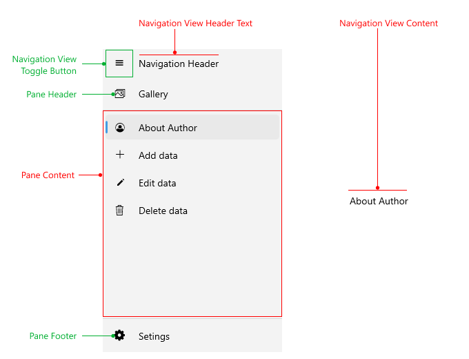

# .NET MAUI NavigationView Visual Structure

The visual structure of the .NET MAUI NavigationView represents the anatomy of the UI component. Being familiar with the visual elements of the NavigationView allows you to quickly find the information required to configure them.

## Displayed Elements

* **NavigationView Header Text**&mdash;Represents a text displayed in the [navigation header]().
* **NavigationView Toggle Button**&mdash;Used for opening/closing the pane. For more details review the [navigation header]() article.
* **Pane Header**&mdash;Sticky area on the top of the [pane]().
* **Pane Content**&mdash;Scrollable area between [the pane header and the pane footer]().. By default all items in the pane are added to the content, if `Position` is not explicitly defined. 
* **Pane Footer**&mdash;Sticky area to the bottom of the [pane]().
* **NavigationView Content**&mdash;Represents a content in the NavigationView.

## See Also

- [Setting different Display Mode]()
- [Selecting an item]()
- [Configure the Navigation Pane]()
- [Configure the Navigation Item]()
- [Configure the Navigation Header]()
- [Navigation Item Styling]()
- [Navigation Pane Styling]()
- [Navigation Header Styling]()
- [Events]()
- [Commands]()
