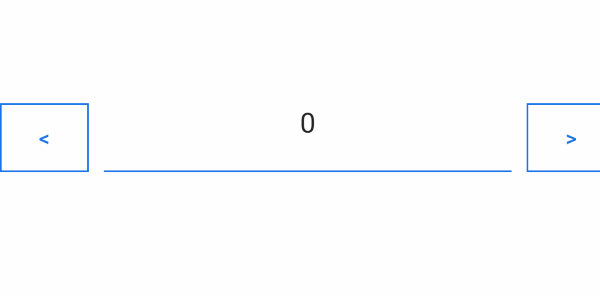

# Customization Options

This article will guide you through all customizations options that NumericInput control provides.

## Numeric Input Buttons Text

The NumericInput provides the following properties for customizing the text in its text input buttons.

* `IncreaseButtonText`(of type `string`): Defines the text displayed inside the **Increase** button. The default string value is `"+"`.
* `DecreaseButtonText`(of type `string`): Defines the text displayed inside the **Decrease** button. The default string value is `"-"`.

The following image shows the result from setting the options.


## Customize Buttons Text

The following example demonstrates how to customize the NumericInput buttons text.

Define the NumericInput.

```XAML
<telerikInput:RadNumericInput x:Name="numericBtnText" IncreaseButtonText="&gt;" DecreaseButtonText="&lt;" />
```

Add the following namespace:

```XAML
xmlns:telerikInput="clr-namespace:Telerik.XamarinForms.Input;assembly=Telerik.Maui.Controls.Compatibility"
```

The following image shows the NumericInput with some custom buttons text.




## Change BackgroundColor

The `BackgroundColor` allows you to change the background color of the NumericInput control.

## See Also

- [Globalization]()
- [Commands]()
