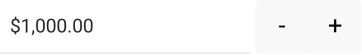

# .NET MAUI NumericInput Globalization

&nbsp;

Globalization is the process of designing and developing your application in such a way that it adapts to different culture configurations. The number formatting also varies between cultures, in addition for some specific symbols, such as decimal separators, currency and other.

The NumericInput provides you the option to define the format of its numeric value through the `StringFormat` property. You can set it to the desired format which will be applied when the control loses focus.

>tip For detailed information about the supported numeric formats, refer to the [Standard Numeric Format Strings](https://docs.microsoft.com/en-us/dotnet/standard/base-types/standard-numeric-format-strings) topic.

Any culture-specific symbols in the display format will be applied according to the `UICulture` of the current thread. If not set explicitly, the `UICulture` is taken from the target device.

Let’s, for example, have the following NumericInput where `C` represents the Currency symbol:

```XAML
<telerik:RadNumericInput Value="1000" 
						 StringFormat="{}{0:C2}" />
```

Depending on the `UICulture` of the current thread, the result is the following:

**NumericInput with UICulture set to “en-US”**



**NumericInput with UICulture set to “de-DE”**


> A string format is applied when the NumericInput control loses focus. So, if you want to switch the thread UICulture dynamically, you need to explicitly focus the NumericInput, then switch the focus to some other control, so that the change to take effect.
>
> Here is a quick snippet:
>
> 		this.input.Focus();
> 		this.othercontrol.Focus();

## See Also

- [Numeric String Format]()
- [Configuration]()
