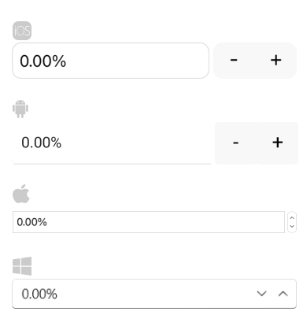

# Numeric Format String

The NumericInput provides you the option to define the format of its numeric value. The desired format which will be applied when the control loses focus.

## String Format

The `StringFormat`(`string`) specifies the string format applied to the numeric value when the control loses focus.

## Standard Numeric Format Strings

You can find detailed information about the supported numeric formats in the [Standard Numeric Format Strings](https://docs.microsoft.com/en-us/dotnet/standard/base-types/standard-numeric-format-strings) Microsoft documentation.

## Example

Define the NumericInput.

<snippet id='numericinput-features-stringformat' />

Add the `telerik` namespace:

```XAML
xmlns:telerik="http://schemas.telerik.com/2022/xaml/maui"
```

Check below the result on different platforms:



## See Also

- [Globalization]()
- [Commands]()
