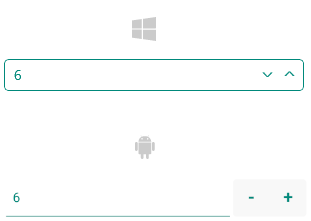
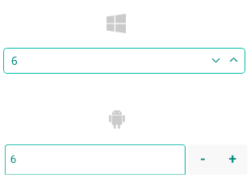

# .NET MAUI NumericInput Styling

The Telerik UI for .NET MAUI NumericInput provides the following Style properties for customizing its look:

* `BackgroundColor`(`Color`)&mdash;Defines the background color of the control.
* `BorderBrush`(`Brush`)&mdash;Defines the color of the border.
* `BorderThickness`(`Thickness`)&mdash;Defines the thickness of the border.
* `CornerRadius`(`CornerRadius`)&mdash;Defines the corner radius of the NumericInput control.
* `IncreaseButtonStyle`(of type `Style` with target type `Telerik.Maui.Controls.RadTemplatedButton`)&mdash;Defines the style for the increase button.
* `DecreaseButtonStyle`(of type `Style` with target type `Telerik.Maui.Controls.RadTemplatedButton`)&mdash;Defines the style for the decrease button.
* `TextInputStyle`(of type `Style` with target type `Telerik.Maui.Controls.RadTextInput`)&mdash;Defines the style of the inner `RadTextInput` control used when the NumericInput is not read-only.

In addition, you can change the visual appearance of the NumericInput by defining the following visual states through the .NET MAUI Visual State Manager:

* `Normal`&mdash;Applied when the NumericInput is in its normal state.
* `Focused`&mdash;Applied when the NumericInput receives focus.
* (Desktop Only) `MouseOver`&mdash;Applied when the mouse cursor is hovering over the NumericInput.
* `ReadOnly`&mdash;Applied when the NumericInput is in read-only mode.
* `ReadonlyFocused`&mdash;Applied when the NumericInput is in read-only mode and receives the focus.
* (Desktop Only) `ReadOnlyMouseOver`&mdash;Applied when the NumericInput is in read-only mode and the mouse cursor is hovering over it.
* `Disabled`**&mdash;Applied when the NumericInput's `IsEnabled` is `False`.

Note that the use of the Background and Border properties in the control template varies by platform:

* On Android, iOS and MacCatalyst&mdash;The `BackgroundColor`, `BorderBrush`, `BorderThickness` and `CornerRadius` are applied to the `RadBorder` containing the input control and not to the whole control template. This means if you set the `BackgroundColor` and `CornerRadius`, for example, they will be applied only to the text input and not in the space (gap) between the input area and the numeric buttons.
* On WinUI&mdash;The `BackgroundColor` and `CornerRadius` are applied on the whole control (the top-most Grid in the control template); the `CornerRadius`, `BorderBrush` and `BorderThickness` properties are applied to a `RadBorder` that will also be visualized over the whole control. So visually, on WinUI, when `BackgroundColor`, `BorderThickness` and `CornerRadius` are applied, they will be visualized wrapping the whole control&mdash;the background will be visible under the input area, as well as the numeric buttons, the corner radius, and border will be visualized wrapping the input and buttons areas.

### Example for NumericInput Styling

The example below demonstrates some of the styling capabilities of the NumericInput, such as custom `IncreaseButtonStyle` and `DecreaseButtonStyle`, `TextInputStyle`, `BorderColor`, and others. It also shows how to switch its appearance through the .NET MAUI Visual State Manager.

**1.** Add a style that targets the `RadNumericInput` to your page's resources and apply all needed styling properties and visual states:

<snippet id='numericinput-custom-styles' />

**2.** Define the NumericInput in XAML:

<snippet id='numericinput-styling-xaml' />

Here is how the NumericInput looks when styling is applied on Android and Windows:

Here is how the NumericInput looks when focused:

## See Also

- [Configuration]()
- [Read-Only Mode]()