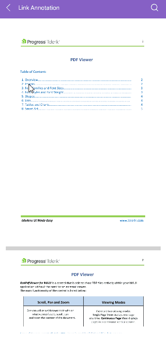
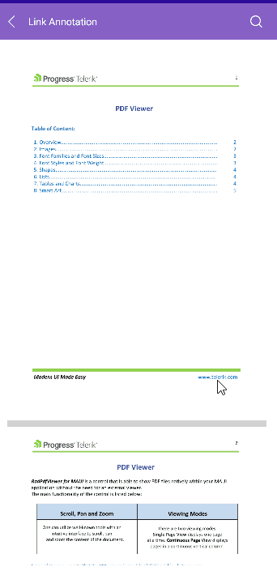

# Link Annotations

The Telerik <a href="https://www.telerik.com/maui-ui/pdf-viewer" target="_blank">.NET MAUI PDF Viewer</a> supports link annotations. This feature allows the user to tap any hyperlink that leads to an absolute URI, and the link will open in the browser. In addition, if the PDF contains links that point to bookmarks in the same document, the viewport scrolls to the destination specified in the link.

The PDF Viewer provides the `LinkAnnotationTapped` event, which allows you to implementing custom logic related to the links in the PDF document:

* `LinkAnnotationTapped`&mdash;Occurs when you click on an annotation such as a hyperlink. It comes handy when you want to detect or even cancel the opening of a web page. 

The `LinkAnnotationTapped` event handler receives two parameters:
* The `sender` argument, which is of type `object`, but can be cast to the `RadPdfViewer` type.
* A `LinkAnnotationTappedEventArgs` object, which provides the following properties:
	* The `LinkAnnotation` property&mdash;It contains the link tapped by the user. The `LinkAnnotation` also holds information about the requested action:
		* `UriAction`&mdash;Open a URI in the browsers. 
		* `GoToAction`&mdash;Move the viewport to position in the same document.
	* The `Handled` boolean property&mdash;A cancellation option for the opening of a page. 

## Link Annotations Example

The example below demonstrates how to detect whether the link annotation leads to a URI or a concrete position in the document, and cancel the navigation in the first case. 

You can implement additional logic for requesting a confirmation from the end user whether to navigate outside of the app in the case of a hyperlink.

**1.** Add the PDF Viewer definition with the event:

<snippet id='pdfviewer-features-annotations-xaml' />

**2.** Add the `LinkAnnotationTapped` event handler:

<snippet id='pdfviewer-annotations-event' />

The following image shows the result from tapping a hyperlink on different platforms:

> For a runnable example with the PDF Viewer Annotations, see the [SDKBrowser Demo Application]() and go to **PdfViewer > Features**.

## See Also

- [PdfViewer Toolbar]()
