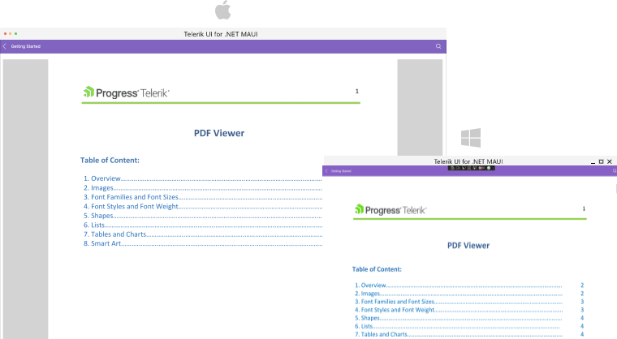
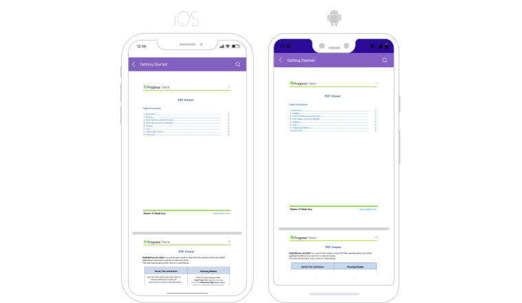

# Getting Started with the .NET MAUI PDF Viewer

This guide provides the information you need to start using the Telerik UI for .NET MAUI PdfViewer by adding the control to your project.

At the end, you will be able to achieve the following result on Desktop platforms.



And the result on mobile platforms:




* [Setting up the app](#1-setting-up-the-app)
* [Adding the required Telerik references](#2-adding-the-required-telerik-references)
* [Adding RadPdfViewer control](#3-adding-radpdfviewer-control)
* [Visualize a Pdf Document](#4-visualize-a-pdf-document)

## Prerequisites

Before adding the PDF Viewer, you need to:

1. [Set up your .NET MAUI application](#step-1-set-up-your-net-maui-application).

1. [Download Telerik UI for .NET MAUI](#step-2-download-telerik-ui-for-net-maui).

1. [Install Telerik UI for .NET MAUI](#step-3-install-telerik-ui-for-net-maui).

1. [Register Required Handlers](#step-4-register-required-handlers).

## Define the Control

**1.** When your .NET MAUI application is setup, you are ready to add a Calendar control to your page. The following example demonstrates the definition of the `RadPdfViewer`:

<snippet id='pdfviewer-getting-started-xaml'/>

**2.** Add the `telerik` namespaces:

```XAML
xmlns:telerik="http://schemas.telerik.com/2022/xaml/maui"
```

**3.** Visualize the pdf document, by setting the `Source` property of the control:

<snippet id='pdfviewer-getting-started' />

Register the Telerik controls through the `Telerik.Maui.Controls.Compatibility.UseTelerik` extension method called inside the `CreateMauiApp` method of the `MauiProgram.cs` file of your project:

```C#
using Telerik.Maui.Controls.Compatibility;

public static class MauiProgram
{
	public static MauiApp CreateMauiApp()
	{
		var builder = MauiApp.CreateBuilder();
		builder
			.UseTelerik()
			.UseMauiApp<App>()
			.ConfigureFonts(fonts =>
			{
				fonts.AddFont("OpenSans-Regular.ttf", "OpenSansRegular");
			});

		return builder.Build();
	}
}           
```

>note The example shows a pdf document visualized as an EmbeddedResource. This is one of the options for loading a pdf with the PdfViewer control. For all available options, see the [Key Features]() topic.

>important For the PdfViewer Getting Started example refer to the [SDKBrowser Demo Application]() PdfViewer -> Getting Started category.

## Additional Resources

- [.NET MAUI PdfViewer Product Page](https://www.telerik.com/maui-ui/pdfviewer)
- [.NET MAUI PdfViewer Forum Page](https://www.telerik.com/forums/maui?tagId=1937)
- [Telerik .NET MAUI Blogs](https://www.telerik.com/blogs/mobile-net-maui)
- [Telerik .NET MAUI Roadmap](https://www.telerik.com/support/whats-new/maui-ui/roadmap)

## See Also

- [Commands]()
- [PdfViewer Toolbar]()
