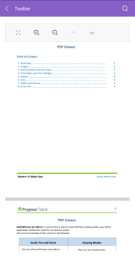

## Layout Modes

The Telerik UI for .NET MAUI PDF Viewer supports two layout modes that you can set through its `LayoutMode` property.

The available options are:

* `ContinuousScroll` (default)&mdash;Displays pages in a continuous vertical column.
* `SinglePage`&mdash;Displays one page at a time.

The current `LayoutMode` can be changed through the `ToggleLayoutModeCommand` and the `ToggleLayoutModeToolbarItem` [`RadPdfViewer` commands]().

Here is how the PDF Viewer looks when the `LayoutMode` is set to `ContinuousScroll`:

The next image shows the PDF Viewer when the `LayoutMode` property is set to `SinglePage`:

## See Also

- [All Commands PDF Viewer provides]()
- [PdfViewer Toolbar]()
