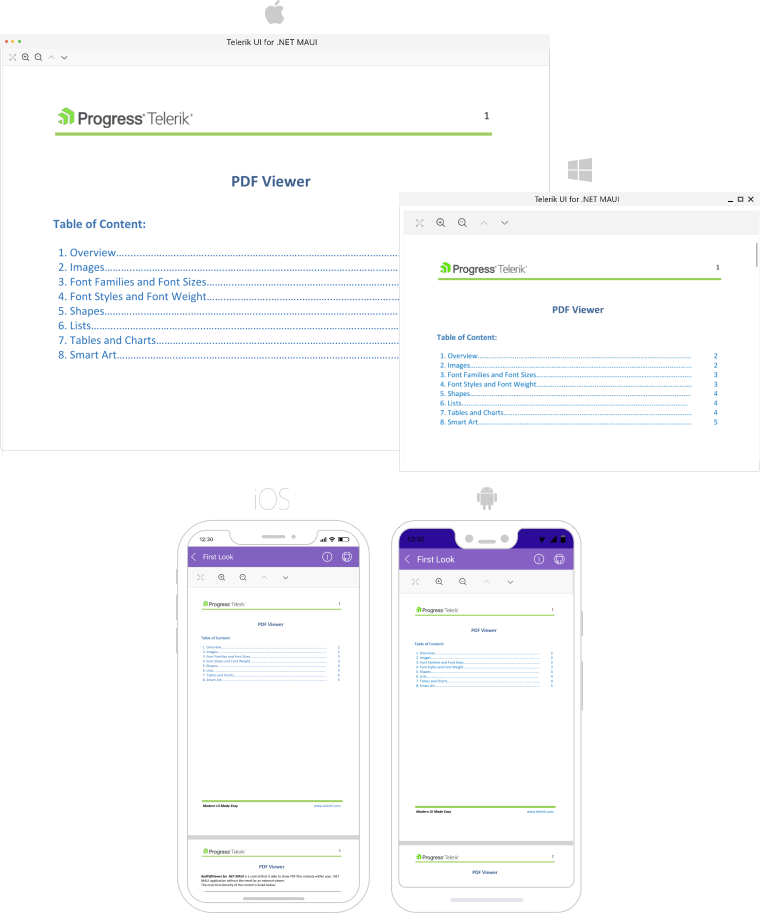

# .NET MAUI PDF Viewer Overview

The Telerik UI for .NET MAUI. PDF Viewer enables you to easily load and display PDF documents in your desktop and mobile applications. The control comes with a handy toolbar including various built-in tool that allow the user to interact with the UI component.

## Key Features

* Visualization PDF documents&mdash;The component displays PDF documents that include images, geometric shapes, different colors (solid, linear, and radial gradients), ordered and unordered lists, and many more. 
* [Support for various document sources]()&mdash;You can load a PDF document from a stream, from a file added as embedded resource, or a file located on the device, and so on.
* [Zooming]()&mdash;The PDF Viewer provides an option for zooming in and zooming out the content of the document. 
* [Single Page and Continuous Scrolling modes]()&mdash;You can choose between two layout modes which allow document scrolling in the PDF Viewer.
* [Commands support]()&mdash;The PDF Viewer allows you to extend the default commands, such as, `ZoomIn`, `ZoomOut`, `NavigateTo`, `FitToWidth`, and `ToggleLayoutMode`.
* [Toolbar]() with predefined items&mdash;Take advantage of a pre-defined UI automatically wired with some of the commands provided by the control through built-in functionality.
* [Toolbar styling]()&mdash;The available styling options allow you to effortlessly change the appearance of the toolbar.

## Next Steps

- [Getting Started with Telerik UI for .NET MAUI PDF Viewer]()

## See Also

- [.NET MAUI PDF Viewer Product Page](https://www.telerik.com/maui-ui/pdfviewer)
- [.NET MAUI PDF Viewer Forum Page](https://www.telerik.com/forums/maui?tagId=2059)
- [Telerik .NET MAUI Blogs](https://www.telerik.com/blogs/mobile-net-maui)
- [Telerik .NET MAUI Roadmap](https://www.telerik.com/support/whats-new/maui-ui/roadmap)
