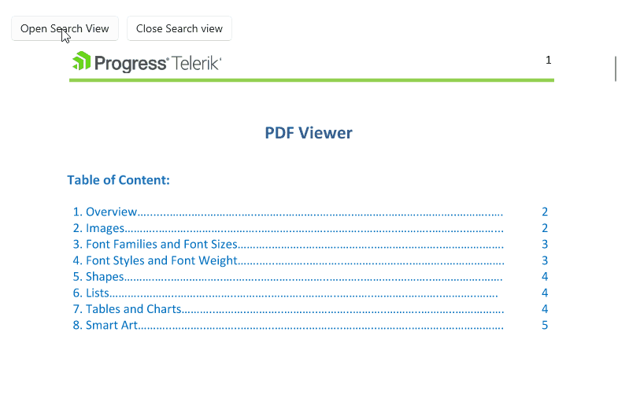

# .NET MAUI PDF Viewer Search Commands

The PDF Viewer for .NET MAUI provides the following commands related to Search feature:

* `OpenSearchViewCommand` (`ICommand`)&mdash;Opens the search view UI for entering the search text.
* `CloseSearchViewCommand` (`ICommand`)&mdash;Closes the search view UI for entering the search text.
* `NavigateToPreviousSearchResultCommand` (`ICommand`)&mdash;Navigates to the previous search result.
* `NavigateToNextSearchResultCommand` (`ICommand`)&mdash;Navigates to the next search result.

## Example

The following example demonstrates how to use the commands. The `OpenSearchView` and `CloseSearchViewCommand` commands are applicable on desktop, as they open the built-in search toolbar item for desktop.

**1.** Define the PDF Viewer control in XAML: 

<snippet id='pdfviewer-search-commands'/>

**2.** Add the following namespace:

```XAML
xmlns:telerik="http://schemas.telerik.com/2022/xaml/maui"
```

The following video shows the commands execution on desktop:



> For the runnable PDF Viewer Search Commands example, see the [SDKBrowser Demo Application]() and go to **PdfViewer > Search > Commands**.

## See Also

- [.NET MAUI PDF Viewer Forum Page](https://www.telerik.com/forums/maui?tagId=2059)
- [Telerik .NET MAUI Blogs](https://www.telerik.com/blogs/mobile-net-maui)
- [Telerik .NET MAUI Roadmap](https://www.telerik.com/support/whats-new/maui-ui/roadmap)
