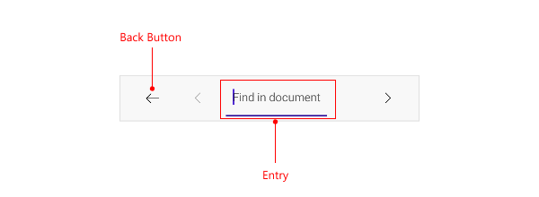

# .NET MAUI PDF Viewer Search Overview

The Telerik UI for .NET MAUI PdfViewer has a support for text search functionality which allows users to find and highlight text inside a PDF document.

You can take advantage of the built-in search toolbar items or search programmatically through the provided methods. 
With the built-in search UI users can enter text and browse through the search results. In addition, a small toast message on mobile showing the count of the search results or a localizable message in case no results are found.

## Search Toolbar on Mobile

Here is how the default search toolbar looks on mobile:

## Search Toolbar on Desktop

Here is how the default search toolbar looks on desktop:

## See Also

- [.NET MAUI PDF Viewer Forum Page](https://www.telerik.com/forums/maui?tagId=2059)
- [Telerik .NET MAUI Blogs](https://www.telerik.com/blogs/mobile-net-maui)
- [Telerik .NET MAUI Roadmap](https://www.telerik.com/support/whats-new/maui-ui/roadmap)
