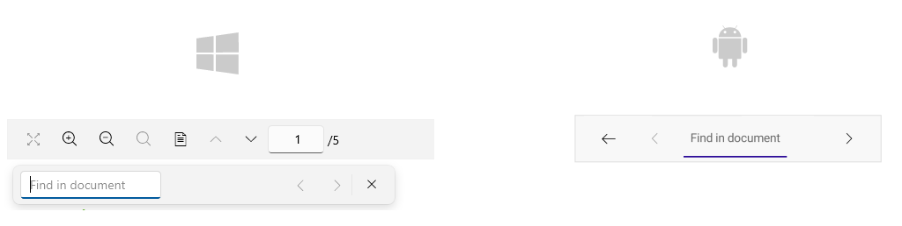
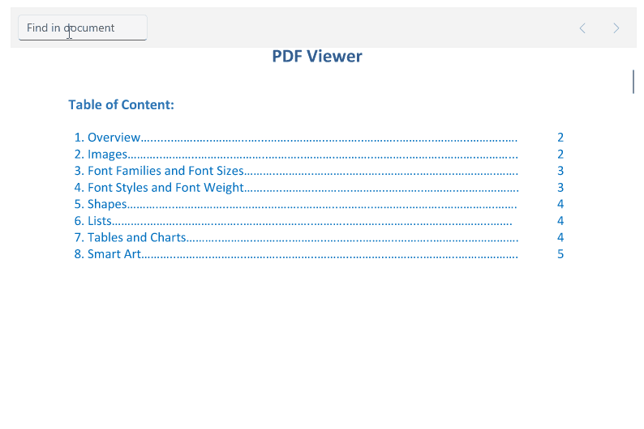

# .NET MAUI PDF Viewer Search Toolbar items

The .NET MAUI PDF Viewer provides built-in support for text searching. Through the exposed commands related to search operation, namely `OpenSearchViewCommand`, `CloseSearchViewCommand`, `NavigateToNextSearchResultCommand`, and `NavigateToPreviousSearchResultCommand` users can manipulate the search toolbar behavior.

In addition, `RadPdfViewerToolbar` exposes predefined toolbar items wired to the search. 

* `PdfViewerSearchNavigationToolbarItem`&mdash;Represents a button item which activates the search functionality in PDF Viewer. This toolbar create a default set of toolbar items within the currently displayed toolbar item. This toolbar item is developed for mobile usage. By default the items are auto-populated. You can disable this by setting the `AutoGenerateItems` to `false`.
* `PdfViewerSearchToolbarItem`&mdash;Represents a button item which activates the search functionality in PDF Viewer. This toolbar create a default set of toolbar items within the currently displayed toolbar item. This toolbar item is developed for desktop usage.

Both toolbar items have predefined items: 

* `PdfViewerNavigateToNextSearchResultToolbarItem`&mdash;Represents a button item which navigates to the next search result in the PDF Viewer control.
* `PdfViewerNavigateToPreviousSearchResultToolbarItem`&mdash;Represents a button item which navigates to the previous search result in the PDF Viewer control.
* `PdfViewerSearchBusyIndicatorToolbarItem`&mdash;Represents a busy indicator which is displayed while calculating the search results.
* `PdfViewerSearchEntryToolbarItem`&mdash;Represents an entry item to input search terms in the search toolbar.

>note If the text in the entry is cleared, the search results will be cleared as well.

This is how the search toolbar looks:



By default, search operation occurs when the user clicks the `Search` button of the keyboard on mobile, and the `Enter` key of the physical keyboard on desktop. You can modify this behavior by setting the `TextSearchTrigger` property of the `SearchSettings`. `TextSearchTrigger` is an enum of type `Telerik.Maui.Controls.PdfViewer.PdfViewerSearchTrigger`, and you can use it to define when a search operation can be performed. The available options are:

* `None`&mdash;Only programmatic calls are allowed
* `TextChanged`&mdash;Search is triggered every time the Text is changed.
* `Completed` (default)&mdash;Search operation is triggered when the corresponding entry completes (by pressing Enter/Return key).

### Example

The following example demonstrates how to use the Toolbar and its predefined items:

**1.** Use the following snippet to define the `RadPdfViewer` and `RadPdfToolbar`:

<snippet id='pdfviewer-toolbar-xaml'/>

**2.** Add the following namespace:

```XAML
xmlns:telerik="http://schemas.telerik.com/2022/xaml/maui"
```

**3.** Then add the following code to visualize the PDF document:

<snippet id='pdfviewer-toolbar'/>

## Custom Search Toolbar

On mobile, customize the `PdfViewerSearchNavigationToolbarItem` by setting the `AutoGenerateItems` to `false`. Then add separate toolbar items to the `Items` collection of the `PdfViewerSearchNavigationToolbarItem`.

Here is an example:

```XAML
<telerik:RadPdfViewerToolbar OverflowMode="Scroll">
    <telerik:PdfViewerSearchToolbarItem IsVisible="{OnIdiom Phone=False, Desktop=True}"/>
    <telerik:PdfViewerSearchNavigationToolbarItem IsVisible="{OnIdiom Phone=True, Desktop=False}" AutoGenerateItems="False">
        <telerik:PdfViewerSearchNavigationToolbarItem.Items>
            <telerik:PdfViewerSearchEntryToolbarItem />
            <telerik:PdfViewerNavigateToPreviousSearchResultToolbarItem/>
            <telerik:PdfViewerNavigateToNextSearchResultToolbarItem/>
        </telerik:PdfViewerSearchNavigationToolbarItem.Items>
    </telerik:PdfViewerSearchNavigationToolbarItem>
    <telerik:PdfViewerToggleLayoutModeToolbarItem />
    <telerik:PdfViewerNavigateToPreviousPageToolbarItem />
    <telerik:PdfViewerNavigateToNextPageToolbarItem />
    <telerik:PdfViewerNavigateToPageToolbarItem />
</telerik:RadPdfViewerToolbar>
```

### Example

The following example demonstrates how to define custom search toolbar:

**1.** Use the following snippet to define the `RadPdfViewer` and `RadPdfToolbar`:

<snippet id='pdfviewer-custom-search-toolbar'/>

**2.** Add the following namespace:

```XAML
xmlns:telerik="http://schemas.telerik.com/2022/xaml/maui"
```

**3.** The Entry `TextChanged` event for searching when text changes:

```C#
private void entrySearchToolbar_TextChanged(object sender, TextChangedEventArgs e)
{
    this.pdfViewer.SearchSettings.SearchAsync(this.entrySearchToolbar.Text, this.pdfViewer.SearchSettings.SearchOptions);
}
```

This is the result with custom toolbar implementation:



## See Also

- [.NET MAUI PDF Viewer Forum Page](https://www.telerik.com/forums/maui?tagId=2059)
- [Telerik .NET MAUI Blogs](https://www.telerik.com/blogs/mobile-net-maui)
- [Telerik .NET MAUI Roadmap](https://www.telerik.com/support/whats-new/maui-ui/roadmap)
