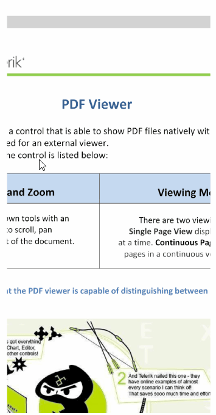

# .NET MAUI PDF Viewer Selection Configuration

The Telerik UI for .NET MAUI PDF Viewer exposes the `SelectionSettings ` property which you can use to configure the colors applied to the selected text and completely customize the displayed selection menu.

This article lists the `SelectionSettings` properties that allow you to customize the selection.

By default, the selection is enabled. If you want to disable the selection, set the `IsSelectionEnabled` to `False`.

## Changing the Fill and Indicator Colors

To control the fill color and the color of the drag handles, use the following properties:

* `SelectionFill`&mdash;Specifies the background color applied to the selected text.
* `SelectionIndicatorColor`&mdash;Specifies the color of both handles around the selected text, which are used to modify the selection. This is applicable on mobile.

## Customizing the Selection Menu

When the user selects some text, this opens a default selection menu (context menu) with a **Copy** action. You can customize this menu by using the following properties:

* `MenuItems` (`PdfViewerSelectionMenuItemCollection`)&mdash;Specifies a collection of menu items that are displayed in the selection menu.
* `SelectionMenuControlTemplate` (`ControlTemplate`)&mdash;Specifies the `ControlTemplate` of the selection menu. The template is used to display the items in the selection menu.
* `PdfViewerSelectionMenuItem`&mdash;Specifies the items that will be added to the `MenuItems` collection. `PdfViewerSelectionMenuItem` has the following properties:
   * `Text` (`string`)&mdash;Specifies the text of the `PdfViewerSelectionMenuItem`.
   * `Command` (`ICommand`)&mdash;Specifies the command associated with the `PdfViewerSelectionMenuItem`.

> The `SelectionMenuControlTemplate` property applies on iOS, MacCatalyst and Android. On WinUI the native context menu is displayed to list the selection menu items.

## Example: PDF Viewer Custom Selection Menu

The following steps demonstrate how to use the PDF Viewer properties to customize the selection menu:

**1.** Add the PDF Viewer definition with the event:

<snippet id='pdfviewer-text-selection-xaml' />

**2.** Define an implicit style for the `PdfViewerSelectionMenu`:

<snippet id='pdfviewer-selectionmenu-style' />

**3.** Add the following view model for the `Command`:

<snippet id='pdfviewer-textselection-viewmodel' />

**4.** Set PDF document to the PDF Viewer's `Source`:

<snippet id='pdfviewer-getting-started' />

This is how the selection looks after applying a customization:

> For the runnable PDF Viewer Selection example, see the [SDKBrowser Demo Application]() and go to **PdfViewer > Selection category**.

## See Also

- [.NET MAUI PDF Viewer Forum Page](https://www.telerik.com/forums/maui?tagId=2059)
- [Telerik .NET MAUI Blogs](https://www.telerik.com/blogs/mobile-net-maui)
- [Telerik .NET MAUI Roadmap](https://www.telerik.com/support/whats-new/maui-ui/roadmap)
