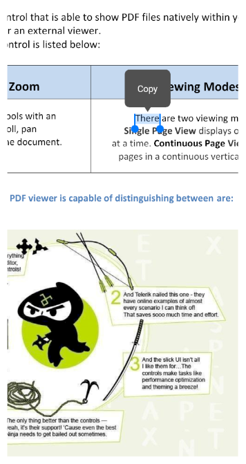
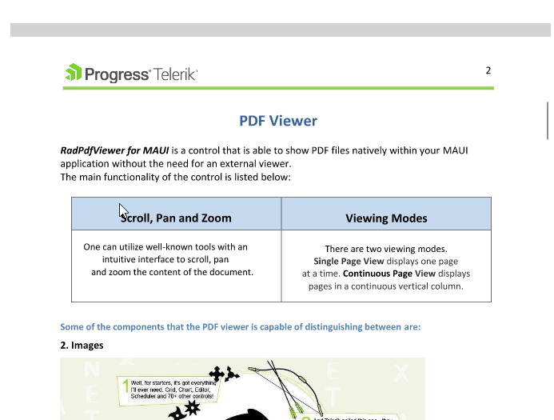

# .NET MAUI PDF Viewer Selection Overview

The Telerik UI for .NET MAUI PdfViewer supports text selection functionality - the end user can initiate a selection action. On mobile through the hold gesture over the text. On desktop and on desktop through mouse click and drag actions - continuous drag extends the current selection. SelectionMenu displays on right-click over the selected text.

The selected text is marked with a different background color and two drag handles are available to the user to make it easier to modify the current selection. In addition, as soon as the selection is made, PDF Viewer displays a customizable SelectionMenu with a default Copy command to allow the user to retrieve the selected text.

## Selection on Mobile

Here is how the default selection looks on mobile:

## Selection on Desktop

Here is how the default selection looks on desktop:

## See Also

- [.NET MAUI PDF Viewer Forum Page](https://www.telerik.com/forums/maui?tagId=2059)
- [Telerik .NET MAUI Blogs](https://www.telerik.com/blogs/mobile-net-maui)
- [Telerik .NET MAUI Roadmap](https://www.telerik.com/support/whats-new/maui-ui/roadmap)
